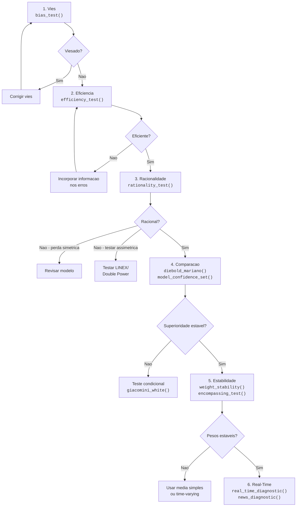

# Diagnosticos de Previsao

!!! abstract "Key Takeaway"
    Um modelo com bom RMSE pode ser **viesado**, **ineficiente** ou **irracional**. Diagnosticos formais revelam patologias ocultas que metricas agregadas nao capturam — e indicam exatamente onde e como melhorar.

## Por que diagnosticar previsoes?

Metricas de erro resumem a performance em um unico numero, mas nao respondem perguntas fundamentais:

- A previsao erra **sistematicamente** para cima ou para baixo? (**Vies**)
- Os erros de previsao sao **previssiveis** com informacao disponivel? (**Eficiencia**)
- A previsao utiliza **toda a informacao** de forma **otima**? (**Racionalidade**)

Diagnosticos formais transformam essas perguntas em **testes de hipotese** com p-valores, permitindo decisoes baseadas em evidencia estatistica.

## Categorias de Diagnostico

O forecastbox organiza os diagnosticos em quatro categorias:

| Categoria | Pergunta | Diagnosticos |
|-----------|----------|-------------|
| **Propriedades Estatisticas** | A previsao tem vies? E eficiente? E racional? | Vies, Eficiencia, Racionalidade |
| **Testes Comparativos** | Modelo A e melhor que B? Qual o melhor conjunto? | DM, MCS, GW |
| **Estabilidade** | Os pesos e relacoes mudam ao longo do tempo? | Estabilidade de Pesos, Encompassing |
| **Real-Time** | Como a previsao se comporta com dados em tempo real? | News Decomposition, Vintages |

## Quick Diagnostic Checklist

Lista rapida de diagnosticos recomendados para cada tipo de exercicio:

!!! success "Previsao individual (1 modelo)"
    - [ ] **Vies incondicional** — `bias_test(errors)` — a previsao erra sistematicamente?
    - [ ] **Eficiencia fraca** — `efficiency_test(errors)` — erros sao autocorrelacionados?
    - [ ] **Mincer-Zarnowitz** — `mincer_zarnowitz(actual, predicted)` — $\alpha = 0, \beta = 1$?
    - [ ] **Tracking signal** — `tracking_signal(errors)` — vies acumula ao longo do tempo?

!!! success "Comparacao entre modelos (2+ modelos)"
    - [ ] **DM Test** — `diebold_mariano(actual, f1, f2)` — diferenca significativa entre 2 modelos?
    - [ ] **MCS** — `model_confidence_set(actual, forecasts)` — qual o melhor conjunto de modelos?
    - [ ] **GW Test** — `giacomini_white(actual, f1, f2)` — superioridade depende do regime?
    - [ ] **Encompassing** — `encompassing_test(actual, f1, f2)` — combinar agrega valor?

!!! success "Combinacao de previsoes"
    - [ ] **Encompassing** — `encompassing_test(actual, forecasts)` — quais modelos agregam informacao?
    - [ ] **Estabilidade de pesos** — `weight_stability(actual, forecasts)` — pesos sao estaveis?

!!! success "Nowcasting"
    - [ ] **News decomposition** — `news_diagnostic(target, vintages, model)` — por que o nowcast mudou?
    - [ ] **Real-time** — `real_time_diagnostic(vintage_db, target, model)` — performance em tempo real?

## Fluxo de Diagnostico Completo

O diagnostico segue uma sequencia logica — cada etapa assume que a anterior foi satisfeita:



!!! tip "Comece pelo vies"
    Se a previsao e viesada, testes de eficiencia e racionalidade serao automaticamente rejeitados. Corrigir o vies primeiro simplifica o diagnostico completo.

### 1. Vies

Verifica se a previsao erra sistematicamente. Se $E[\hat{y}_t - y_t] \neq 0$, a previsao tem vies incondicional e pode ser melhorada com um simples ajuste de nivel.

### 2. Eficiencia

Testa se os erros de previsao contem informacao exploravel. Erros autocorrelacionados ou correlacionados com variaveis observaveis indicam que a previsao poderia ser melhorada.

### 3. Racionalidade

Teste conjunto de nao-vies e eficiencia. Uma previsao racional utiliza toda a informacao disponivel de forma otima dado o objetivo (funcao de perda).

### 4. Comparacao e alem

Com propriedades individuais verificadas, compara-se modelos entre si (DM, MCS, GW), avalia-se estabilidade dos pesos de combinacao, e diagnostica-se o comportamento em tempo real.

## Tabela Completa de Diagnosticos

| Diagnostico | Hipotese Nula ($H_0$) | Teste | Funcao | Pagina |
|------------|----------------------|-------|--------|--------|
| Vies incondicional | $E[e_t] = 0$ | t-test | `bias_test()` | [Vies](bias.md) |
| Vies condicional | $\alpha = 0$ em $e_t = \alpha + \beta z_t + u_t$ | Regressao OLS + F-test | `bias_test(test="regression")` | [Vies](bias.md) |
| Tracking signal | $\|TS_t\| \leq 4$ | Monitoramento | `tracking_signal()` | [Vies](bias.md) |
| Eficiencia fraca | Erros nao autocorrelacionados | Ljung-Box, Breusch-Godfrey | `efficiency_test()` | [Eficiencia](efficiency.md) |
| Eficiencia semi-forte | Erros ortogonais a $\mathcal{F}_t$ | Regressao auxiliar | `efficiency_test(variables=...)` | [Eficiencia](efficiency.md) |
| Mincer-Zarnowitz | $\alpha = 0, \beta = 1$ | F-test conjunto | `mincer_zarnowitz()` | [Eficiencia](efficiency.md) |
| Racionalidade (simetrica) | Nao-vies + eficiencia | Wald test | `rationality_test()` | [Racionalidade](rationality.md) |
| Racionalidade (assimetrica) | Otimalidade sob LINEX | Momento condicional | `rationality_test(loss="linex")` | [Racionalidade](rationality.md) |
| Diebold-Mariano | Igual poder preditivo | t-test modificado | `diebold_mariano()` | [DM Test](dm-test.md) |
| Model Confidence Set | Modelos equivalentes | Eliminacao sequencial | `mcs()` | [MCS](mcs-diagnostic.md) |
| Giacomini-White | Superioridade condicional | Wald test | `giacomini_white()` | [GW Test](gw-test.md) |
| Encompassing | Modelo A engloba B | Regressao Fair-Shiller | `encompassing_test()` | [Encompassing](encompassing-test.md) |
| Estabilidade de pesos | Pesos constantes | CUSUM, Bai-Perron | `weight_stability()` | [Estabilidade](weight-stability.md) |
| News decomposition | Consistencia da revisao | Decomposicao aditiva | `news_diagnostic()` | [News](news-diagnostic.md) |
| Real-time | Performance em tempo real | Vintage analysis | `real_time_diagnostic()` | [Real-Time](real-time.md) |

## Quick Start

```python
from forecastbox.diagnostics import (
    bias_test, efficiency_test, rationality_test
)

# Previsao e realizado
actual = y_test
predicted = y_pred
errors = actual - predicted

# 1. Vies
bt = bias_test(errors)
print(f"Vies medio: {bt.mean_error:.4f}, p-valor: {bt.pvalue:.4f}")

# 2. Eficiencia
et = efficiency_test(errors, max_lags=4)
print(f"Ljung-Box Q: {et.statistic:.3f}, p-valor: {et.pvalue:.4f}")

# 3. Racionalidade
rt = rationality_test(actual, predicted)
print(f"Wald stat: {rt.statistic:.3f}, p-valor: {rt.pvalue:.4f}")
```

```text
Vies medio: 0.0023, p-valor: 0.7812
Ljung-Box Q: 3.241, p-valor: 0.5186
Wald stat: 1.872, p-valor: 0.3925
```

## Mapa de Cross-References

Cada diagnostico conecta com a pagina de teoria correspondente e o guia pratico no User Guide:

| Diagnostico | Teoria | User Guide |
|-------------|--------|------------|
| [Vies](bias.md) | [Avaliacao](../theory/evaluation-theory.md) | [Mincer-Zarnowitz](../user-guide/evaluation/mincer-zarnowitz.md) |
| [Eficiencia](efficiency.md) | [Avaliacao](../theory/evaluation-theory.md) | [Metricas](../user-guide/evaluation/metrics.md) |
| [Racionalidade](rationality.md) | [Avaliacao](../theory/evaluation-theory.md) | [Mincer-Zarnowitz](../user-guide/evaluation/mincer-zarnowitz.md) |
| [DM Test](dm-test.md) | [Diebold-Mariano](../theory/evaluation-theory.md) | [Diebold-Mariano](../user-guide/evaluation/diebold-mariano.md) |
| [MCS](mcs-diagnostic.md) | [MCS Teoria](../theory/mcs-theory.md) | [Model Confidence Set](../user-guide/evaluation/mcs.md) |
| [GW Test](gw-test.md) | [Condicionais](../theory/conditional-theory.md) | [Giacomini-White](../user-guide/evaluation/giacomini-white.md) |
| [Estabilidade](weight-stability.md) | [Combinacao](../theory/combination-theory.md) | [Escolhendo Metodo](../user-guide/combination/choosing.md) |
| [Encompassing](encompassing-test.md) | [Combinacao](../theory/combination-theory.md) | [Encompassing](../user-guide/evaluation/encompassing.md) |
| [News](news-diagnostic.md) | [News Decomposition](../theory/nowcasting-theory.md) | [News](../user-guide/nowcasting/news.md) |
| [Real-Time](real-time.md) | [Nowcasting](../theory/nowcasting-theory.md) | [Vintages](../user-guide/nowcasting/vintages.md) |

## Guia de Navegacao

<div class="grid cards" markdown>

- :material-arrow-collapse-up: **[Vies](bias.md)**

    Teste de vies incondicional, condicional e tracking signal

- :material-lightning-bolt: **[Eficiencia](efficiency.md)**

    Testes de autocorrelacao, Ljung-Box e regressao auxiliar

- :material-brain: **[Racionalidade](rationality.md)**

    Teste conjunto de Mincer-Zarnowitz e perda assimetrica

- :material-scale-balance: **[DM Test](dm-test.md)**

    Teste de igualdade de poder preditivo

- :material-select-group: **[MCS Diagnostic](mcs-diagnostic.md)**

    Conjunto de modelos superiores

- :material-test-tube: **[GW Test](gw-test.md)**

    Teste condicional de superioridade preditiva

- :material-chart-timeline-variant: **[Estabilidade de Pesos](weight-stability.md)**

    Estabilidade temporal dos pesos de combinacao

- :material-set-merge: **[Encompassing](encompassing-test.md)**

    Teste se um modelo agrega informacao sobre outro

- :material-newspaper: **[News Diagnostic](news-diagnostic.md)**

    Decomposicao de revisao por contribuicao de dados novos

- :material-clock-outline: **[Real-Time](real-time.md)**

    Diagnostico com dados em tempo real e vintages

</div>
