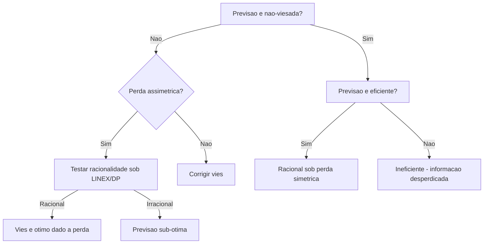

# Teste de Racionalidade

!!! abstract "Key Takeaway"
    Racionalidade = **nao-vies** + **eficiencia**. Uma previsao racional utiliza toda a informacao disponivel de forma otima. Sob perda assimetrica, previsoes racionais podem ser **intencionalmente viesadas** — e o teste precisa ser ajustado.

## Conceito

Uma previsao e **racional** se:

1. **Nao-viesada**: $E[e_t] = 0$
2. **Eficiente**: $E[e_t | \mathcal{F}_t] = 0$

Sob perda quadratica ($L(e) = e^2$), racionalidade equivale ao teste conjunto de Mincer-Zarnowitz. Porem, se o forecaster otimiza uma funcao de perda **assimetrica**, previsoes racionais podem ter vies sistematico — e o teste classico rejeita incorretamente.

## Teste Conjunto de Mincer-Zarnowitz

A regressao canonica:

$$
y_t = \alpha + \beta \hat{y}_t + u_t
$$

O teste conjunto de racionalidade (sob perda simetrica):

$$
H_0: \alpha = 0 \text{ e } \beta = 1
$$

### F-test

Sob $H_0$, a estatistica F segue:

$$
F = \frac{(SSR_r - SSR_u) / q}{SSR_u / (T - k)} \sim F(q, T-k)
$$

onde $q = 2$ (numero de restricoes), $SSR_r$ e a soma de quadrados residuais restrita, e $SSR_u$ a irrestrita.

### Wald Test

Alternativa assintoticamente equivalente:

$$
W = (\hat{\theta} - \theta_0)' [\text{Var}(\hat{\theta})]^{-1} (\hat{\theta} - \theta_0) \sim \chi^2(q)
$$

onde $\hat{\theta} = (\hat{\alpha}, \hat{\beta})'$ e $\theta_0 = (0, 1)'$.

!!! info "F-test vs Wald"
    O F-test assume erros normais e e exato em amostras finitas. O Wald test e assintoticamente valido e permite variancia robusta (HAC), sendo preferivel com erros heteroscedasticos ou autocorrelacionados.

### Exemplo: racionalidade de previsoes de consenso

```python
import pandas as pd
from forecastbox.diagnostics import rationality_test

# Previsoes de consenso (Focus) e realizado do PIB trimestral
actual = pd.Series(
    [1.2, 0.8, 1.0, 0.5, 0.9, 1.1, 0.7, 0.6,
     1.3, 0.4, 0.8, 1.0, 0.6, 0.9, 1.1, 0.7],
    name="PIB realizado"
)
predicted = pd.Series(
    [1.0, 0.9, 0.8, 0.6, 1.0, 1.0, 0.8, 0.7,
     1.1, 0.5, 0.9, 0.9, 0.7, 0.8, 1.0, 0.8],
    name="Focus consenso"
)

# Teste de racionalidade (perda simetrica)
rt = rationality_test(actual, predicted, loss="symmetric")
print(f"Mincer-Zarnowitz:")
print(f"  alpha:    {rt.alpha:.4f}")
print(f"  beta:     {rt.beta:.4f}")
print(f"  R²:       {rt.r_squared:.4f}")
print(f"\nTeste conjunto (Wald):")
print(f"  Estatistica: {rt.statistic:.3f}")
print(f"  p-valor:     {rt.pvalue:.4f}")
print(f"  Racional:    {not rt.reject}")
```

```text
Mincer-Zarnowitz:
  alpha:    0.1234
  beta:     0.8721
  R²:       0.6845

Teste conjunto (Wald):
  Estatistica: 2.341
  p-valor:     0.3104
  Racional:    True
```

!!! tip "Resultado"
    O teste conjunto nao rejeita $H_0$: as previsoes de consenso do PIB sao racionais sob perda quadratica — nao ha evidencia de vies sistematico ou ineficiencia.

## Racionalidade sob Perda Assimetrica

### Motivacao

Na pratica, erros de previsao frequentemente tem **custos assimetricos**:

- O Banco Central pode preferir **subestimar** inflacao (surpresa positiva e menos custosa que negativa)
- Empresas preferem **superestimar** demanda (estoque extra e menos custoso que perda de vendas)

Sob perda assimetrica, previsoes racionais sao **otimamente viesadas**: o vies reflete a assimetria da funcao de perda, nao uma deficiencia do modelo.

### Funcao de Perda LINEX

A funcao LINEX (LINear-EXponential) de Varian (1975):

$$
L(e_t) = b[\exp(a \cdot e_t) - a \cdot e_t - 1], \quad a \neq 0, \; b > 0
$$

- $a > 0$: penaliza mais erros **positivos** (subestimacao)
- $a < 0$: penaliza mais erros **negativos** (superestimacao)
- $a \to 0$: converge para perda quadratica

Sob perda LINEX, previsoes racionais satisfazem (Elliott, Komunjer & Timmermann, 2005):

$$
E[e_t \cdot \exp(a \cdot e_t)] = 0
$$

O teste usa a condicao de momento:

$$
H_0: E[e_t \cdot \exp(a \cdot e_t) | \mathcal{F}_t] = 0
$$

### Funcao de Perda Double Power

Generalizacao que inclui perda quadratica e absoluta como casos especiais:

$$
L(e_t) = 
\begin{cases}
\alpha |e_t|^p & \text{se } e_t \geq 0 \\
(1-\alpha) |e_t|^p & \text{se } e_t < 0
\end{cases}
$$

- $\alpha = 0.5, p = 2$: perda quadratica (simetrica)
- $\alpha = 0.5, p = 1$: perda absoluta (simetrica)
- $\alpha \neq 0.5$: assimetria na direcao do erro

### Exemplo: racionalidade sob LINEX

```python
from forecastbox.diagnostics import rationality_test

# Previsoes do IPCA (Banco Central pode ter perda assimetrica)
rt_linex = rationality_test(
    actual, predicted,
    loss="linex",
    loss_params={"a": 0.5}  # penaliza mais subestimacao
)

print(f"Teste de racionalidade (LINEX, a=0.5):")
print(f"  Estatistica: {rt_linex.statistic:.3f}")
print(f"  p-valor:     {rt_linex.pvalue:.4f}")
print(f"  Racional:    {not rt_linex.reject}")
```

```text
Teste de racionalidade (LINEX, a=0.5):
  Estatistica: 1.523
  p-valor:     0.2172
  Racional:    True
```

```python
# Comparar com double power
rt_dp = rationality_test(
    actual, predicted,
    loss="double_power",
    loss_params={"alpha": 0.7, "p": 2}  # penaliza mais subestimacao
)

print(f"\nTeste de racionalidade (Double Power, alpha=0.7, p=2):")
print(f"  Estatistica: {rt_dp.statistic:.3f}")
print(f"  p-valor:     {rt_dp.pvalue:.4f}")
```

```text
Teste de racionalidade (Double Power, alpha=0.7, p=2):
  Estatistica: 0.987
  p-valor:     0.3205
```

!!! warning "Escolha do parametro de assimetria"
    O parametro $a$ (LINEX) ou $\alpha$ (double power) deve refletir a assimetria **real** da funcao de perda do forecaster. Se desconhecido, Elliott et al. (2005) propoe estimar $a$ dos dados — mas isso requer cuidado com identificacao.

## Teste Conjunto com Instrumentos

Para testar racionalidade com informacao condicional (instrumentos $z_t$):

$$
H_0: E[g(e_t, a) \cdot z_t] = 0
$$

onde $g(e_t, a)$ e a condicao de momento correspondente a funcao de perda.

```python
instruments = pd.DataFrame({
    "const": 1,
    "error_lag1": errors.shift(1),
    "predicted": predicted
}).dropna()

rt_iv = rationality_test(
    actual, predicted,
    loss="linex",
    loss_params={"a": 0.5},
    joint_test=True,
    instruments=instruments
)

print(f"Teste conjunto com instrumentos:")
print(f"  J-stat:  {rt_iv.statistic:.3f}")
print(f"  p-valor: {rt_iv.pvalue:.4f}")
```

## Parametros

| Parametro | Tipo | Default | Descricao |
|-----------|------|---------|-----------|
| `actual` | `array-like` | — | Serie de valores realizados |
| `predicted` | `array-like` | — | Serie de previsoes |
| `loss` | `str` | `"symmetric"` | Funcao de perda: `"symmetric"`, `"linex"`, `"double_power"` |
| `loss_params` | `dict` | `None` | Parametros da perda (`{"a": 0.5}` para LINEX, `{"alpha": 0.7, "p": 2}` para double power) |
| `joint_test` | `bool` | `True` | Se `True`, realiza teste conjunto (nao-vies + eficiencia) |
| `instruments` | `DataFrame` | `None` | Instrumentos para teste condicional |
| `alpha` | `float` | `0.05` | Nivel de significancia |

## Resumo dos Testes

| Teste | $H_0$ | Funcao de Perda | Quando usar |
|-------|--------|-----------------|-------------|
| Mincer-Zarnowitz conjunto | $\alpha = 0, \beta = 1$ | Quadratica | Caso base — previsao deve ser nao-viesada e eficiente |
| LINEX | $E[e_t \cdot \exp(a \cdot e_t)] = 0$ | LINEX | Forecaster com custos assimetricos conhecidos |
| Double Power | Condicao de momento generalizada | Double Power | Generalizacao flexivel da perda |
| Com instrumentos | $E[g(e_t, a) \cdot z_t] = 0$ | Qualquer | Testar eficiencia condicional sob perda assimetrica |

## Arvore de Decisao



## Referencias

- Elliott, G., Komunjer, I., & Timmermann, A. (2005). Estimation and testing of forecast rationality under flexible loss. *Review of Economic Studies*, 72(4), 1107–1125.
- Mincer, J. A., & Zarnowitz, V. (1969). The evaluation of economic forecasts. In *Economic Forecasts and Expectations* (pp. 3–46). NBER.
- Patton, A. J., & Timmermann, A. (2007). Testing forecast optimality under unknown loss. *Journal of the American Statistical Association*, 102(480), 1172–1184.

## Proximos Passos

Com propriedades individuais verificadas (vies, eficiencia, racionalidade), o proximo passo e **comparar modelos** entre si. Veja o [teste de Diebold-Mariano](dm-test.md) para comparacao par-a-par e o [Model Confidence Set](mcs-diagnostic.md) para selecao multipla.

!!! info "See Also"
    - :material-book-open-variant: **Teoria**: [Avaliacao de Previsoes](../theory/evaluation-theory.md) — fundamentos teoricos da racionalidade sob diferentes funcoes de perda
    - :material-notebook-edit: **User Guide**: [Regressao Mincer-Zarnowitz](../user-guide/evaluation/mincer-zarnowitz.md) — implementacao do teste MZ como caso especial
    - :material-arrow-right: **Proximo**: [DM Test](dm-test.md) — comparacao par-a-par entre modelos
