# Escolhendo o Metodo

Nem todo problema de previsao pede a mesma abordagem. Este guia ajuda voce a
identificar rapidamente qual modulo do forecastbox usar -- e quando combinar
mais de um.

---

## Arvore de Decisao

O fluxograma abaixo resume as principais perguntas que levam a cada abordagem:

```mermaid
flowchart TD
    Q["Qual e o seu objetivo?"]

    Q --> U["Previsao de uma<br/>ou poucas series"]
    Q --> M["Previsao multivariada"]
    Q --> C["Melhorar previsoes<br/>existentes"]
    Q --> N["Previsao em<br/>tempo real"]
    Q --> S["Analise de<br/>cenarios"]

    U --> U1["Serie longa >100 obs"]
    U --> U2["Poucas series /<br/>sem preferencia"]
    U1 --> R1([AutoARIMA / AutoETS])
    U2 --> R2([AutoSelect])

    M --> R3([AutoVAR])

    C --> C1["Poucas previsoes < 5"]
    C --> C2["Muitas previsoes"]
    C --> C3["Instabilidade temporal"]
    C1 --> R4([Media simples / OLS])
    C2 --> R5([BMA / Stacking])
    C3 --> R6([Time-varying weights])

    N --> N1["Frequencias mistas"]
    N --> N2["Fator latente"]
    N --> N3["Simples e rapido"]
    N1 --> R7([MIDAS])
    N2 --> R8([DFM])
    N3 --> R9([Bridge equations])

    S --> S1["E se X acontecer?"]
    S --> S2["Distribuicao de riscos"]
    S --> S3["Resiliencia"]
    S1 --> R10([Conditional forecast])
    S2 --> R11([Monte Carlo + Fan charts])
    S3 --> R12([Stress testing])

    style Q fill:#4051b5,color:#fff
    style R1 fill:#43a047,color:#fff
    style R2 fill:#43a047,color:#fff
    style R3 fill:#43a047,color:#fff
    style R4 fill:#fb8c00,color:#fff
    style R5 fill:#fb8c00,color:#fff
    style R6 fill:#fb8c00,color:#fff
    style R7 fill:#e53935,color:#fff
    style R8 fill:#e53935,color:#fff
    style R9 fill:#e53935,color:#fff
    style R10 fill:#8e24aa,color:#fff
    style R11 fill:#8e24aa,color:#fff
    style R12 fill:#8e24aa,color:#fff
```



!!! tip "Regra rapida"

    Se voce esta comecando agora, use **AutoSelect** -- ele testa todos os
    modelos do ModelZoo e retorna o melhor automaticamente. Voce pode refinar
    depois.

---

## Tabela Comparativa

| Criterio | Auto-Forecast | Combinacao | Nowcasting | Cenarios |
|----------|:------------:|:----------:|:----------:|:--------:|
| **Complexidade** | Baixa | Media | Alta | Media |
| **Dados necessarios** | 1 serie temporal | N previsoes ja geradas | Multiplas frequencias | Serie + condicoes |
| **Melhor para** | Baseline rapido | Robustez e precisao | Estimativa real-time | Gestao de risco |
| **Dependencias** | chronobox | forecastbox | kalmanbox | forecastbox |
| **Horizonte tipico** | Curto a medio prazo | Qualquer | Trimestre corrente | Condicional |

!!! warning "Nowcasting requer kalmanbox"

    O modulo de nowcasting depende do **kalmanbox** para modelos de espaco de
    estados (DFM, MIDAS). Certifique-se de instala-lo:

    ```bash
    pip install kalmanbox
    ```

---

## Exemplos por Caso de Uso

### 1. "Preciso de uma previsao rapida do PIB"

Use **AutoForecast** para gerar um baseline com selecao automatica de modelo:

```python
from forecastbox import AutoARIMA
from forecastbox.datasets import load_gdp

data = load_gdp()
result = AutoARIMA().fit_predict(data, horizon=4)
print(result.forecast)
```

O `AutoARIMA` busca a melhor especificacao ARIMA via criterios de informacao
(AIC/BIC) e retorna um [Forecast Container](core-concepts.md#forecast-container)
com previsoes e intervalos de confianca.

!!! tip "Quando usar AutoSelect"

    Se voce nao tem certeza se ARIMA e o melhor modelo, use `AutoSelect` --
    ele testa todos os modelos do [ModelZoo](core-concepts.md#modelzoo) e
    seleciona o vencedor:

    ```python
    from forecastbox import AutoSelect

    best = AutoSelect().fit_predict(data, horizon=4)
    print(f"Melhor modelo: {best.model_name}")
    ```

---

### 2. "Tenho 10 modelos e quero a melhor combinacao"

Use **combine()** para agregar previsoes de multiplos modelos:

```python
from forecastbox import AutoARIMA, AutoETS, Theta, combine

forecasts = [
    AutoARIMA().fit_predict(data, horizon=4),
    AutoETS().fit_predict(data, horizon=4),
    Theta().fit_predict(data, horizon=4),
]

combined = combine(forecasts, method="bma")
print(f"Pesos: {combined.weights}")
print(combined.forecast)
```

O metodo `bma` (Bayesian Model Averaging) atribui pesos proporcionais a
verossimilhanca marginal de cada modelo, penalizando automaticamente modelos
mais complexos.

!!! info "Escolhendo o metodo de combinacao"

    | Situacao | Metodo recomendado |
    |----------|-------------------|
    | Poucos modelos, sem historico | `simple_average` |
    | Dados de validacao disponiveis | `ols` ou `stacking` |
    | Incerteza sobre o melhor modelo | `bma` |
    | Pesos instáveis ao longo do tempo | `time_varying` |

    Veja o [User Guide de Combinacao](../user-guide/combination/index.md)
    para detalhes de cada metodo.

---

### 3. "Quero projetar o PIB do trimestre corrente"

Use **Nowcast** para estimar o valor do periodo corrente usando indicadores
de alta frequencia:

```python
from forecastbox.nowcast import DFM

model = DFM(n_factors=2)
model.fit(
    target=gdp_quarterly,
    indicators=monthly_indicators,  # ex: producao industrial, PMI
)

now = model.nowcast()
print(f"Nowcast PIB: {now.forecast.iloc[-1]:.2f}%")
```

O DFM (Dynamic Factor Model) extrai fatores latentes comuns de indicadores
mensais e os usa para projetar a variavel trimestral alvo, lidando
automaticamente com a diferenca de frequencia.

!!! tip "Atualizacao em tempo real"

    O nowcast e atualizado conforme novos dados mensais sao publicados.
    Use `model.update(new_data)` para incorporar novos indicadores sem
    re-estimar o modelo do zero.

---

### 4. "Quero simular cenario de juros altos"

Use **ScenarioBuilder** para previsao condicional e analise de risco:

```python
from forecastbox.scenarios import ScenarioBuilder

builder = ScenarioBuilder(baseline_model=var_model)
scenario = builder.conditional_forecast(
    conditions={"selic": [14.25, 15.0, 15.5, 15.5]},
    horizon=4,
)

print("PIB sob cenario de juros altos:")
print(scenario.forecast["gdp_growth"])
```

O `ScenarioBuilder` fixa os valores das variaveis condicionantes e gera
previsoes para as demais variaveis do sistema, respeitando as correlacoes
estimadas pelo modelo VAR subjacente.

!!! warning "Cenarios requerem modelo multivariado"

    A previsao condicional exige um modelo que capture as relacoes entre
    variaveis (ex: `AutoVAR`). Modelos univariados como `AutoARIMA` nao
    suportam condicionamento.

---

## Quando Combinar Abordagens

Na pratica, as abordagens do forecastbox nao sao mutuamente exclusivas.
Combinacoes comuns incluem:

### Auto-Forecast + Combinacao

A estrategia mais comum: gerar previsoes individuais com diferentes modelos
e depois combina-las para ganhar robustez.

```python
from forecastbox import AutoARIMA, AutoETS, Theta, combine

# Gerar previsoes individuais
models = [AutoARIMA(), AutoETS(), Theta()]
forecasts = [m.fit_predict(data, horizon=4) for m in models]

# Combinar com pesos otimos (Bates-Granger)
combined = combine(forecasts, method="optimal")
```

!!! tip "Por que combinar?"

    A literatura economica mostra que combinacoes de previsoes frequentemente
    superam o melhor modelo individual, especialmente quando ha incerteza
    sobre qual modelo e o mais adequado (Timmermann, 2006).

### Nowcasting + Cenarios

Use nowcasting para estimar o periodo corrente e depois construa cenarios
para o futuro a partir dessa estimativa atualizada:

```python
from forecastbox.nowcast import DFM
from forecastbox.scenarios import ScenarioBuilder

# Estimar o PIB do trimestre corrente
dfm = DFM(n_factors=2).fit(target=gdp, indicators=indicators)
current = dfm.nowcast()

# Usar o nowcast como ponto de partida para cenarios
builder = ScenarioBuilder(baseline_model=var_model)
scenario = builder.conditional_forecast(
    conditions={"selic": [14.25, 15.0]},
    horizon=2,
    initial_values=current.forecast,
)
```

### Auto-Forecast + Avaliacao rigorosa

Antes de colocar qualquer previsao em producao, valide com cross-validation
temporal e testes estatisticos:

```python
from forecastbox import AutoSelect
from forecastbox.evaluate import CrossValidation, diebold_mariano

# Selecionar melhor modelo
best = AutoSelect().fit_predict(train, horizon=4)

# Validar com cross-validation expanding window
cv = CrossValidation(strategy="expanding", n_splits=5, horizon=4)
results = cv.evaluate(model=AutoSelect(), data=data)
print(results.summary())
```

!!! info "Pipeline completo"

    Para workflows de producao que encadeiam varias etapas (auto-forecast,
    combinacao, avaliacao e monitoramento), veja o
    [User Guide de Pipeline](../user-guide/pipeline/index.md).

---

## Resumo: Qual Abordagem Usar?

| Voce quer... | Use | Modulo |
|-------------|-----|--------|
| Previsao rapida de uma serie | `AutoARIMA` / `AutoSelect` | `forecastbox.auto` |
| Combinar varios modelos | `combine()` | `forecastbox.combine` |
| Estimar o trimestre corrente | `DFM` / `MIDAS` | `forecastbox.nowcast` |
| Simular cenarios alternativos | `ScenarioBuilder` | `forecastbox.scenarios` |
| Avaliar e comparar modelos | `CrossValidation` / `diebold_mariano` | `forecastbox.evaluate` |

---

## Proximos Passos

<div class="grid cards" markdown>

- :material-auto-fix: **[Auto-Forecast](../user-guide/auto-forecast/index.md)**

    Selecao automatica de modelos univariados e multivariados

- :material-set-merge: **[Combinacao](../user-guide/combination/index.md)**

    Os 7 metodos de combinacao de previsoes

- :material-chart-timeline: **[Nowcasting](../user-guide/nowcasting/index.md)**

    Previsao em tempo real com DFM, MIDAS e Bridge equations

- :material-map-marker-path: **[Cenarios](../user-guide/scenarios/index.md)**

    Previsao condicional, stress testing e Monte Carlo

</div>
