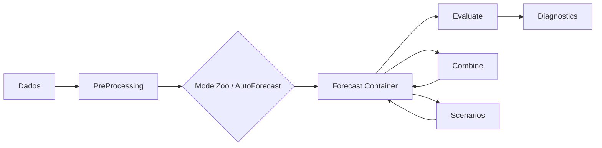

# Conceitos Fundamentais

Antes de mergulhar nos detalhes de cada modulo, e importante entender os
conceitos que sustentam o forecastbox. Esta pagina apresenta os cinco pilares
da biblioteca: o **Forecast Container**, as **metricas de avaliacao**, a
**cross-validation temporal**, o **ModelZoo** e a **arquitetura geral**.

---

## Forecast Container

O `Forecast` e o objeto central do forecastbox. Toda previsao gerada pela
biblioteca -- seja de um unico modelo ou de uma combinacao -- e encapsulada
neste container, garantindo uma interface uniforme para avaliacao, visualizacao
e exportacao.

Um Forecast Container armazena:

| Componente | Descricao |
|------------|-----------|
| **Point forecast** | Serie de valores previstos |
| **Prediction intervals** | Intervalos de confianca (ex: 80%, 95%) |
| **Metadados do modelo** | Nome, parametros, timestamp de criacao |
| **Historico** | Dados usados no ajuste |
| **Metricas in-sample** | AIC, BIC, log-likelihood do ajuste |

### Exemplo de uso

```python
from forecastbox.core import Forecast

fc = Forecast(
    values=predicted_values,
    index=future_dates,
    model_name="AutoARIMA(1,1,1)",
    confidence_intervals={0.95: (lower, upper)},
    metadata={"aic": 123.4, "bic": 125.6}
)

# Acessar componentes
print(fc.forecast)           # Serie de previsoes
print(fc.model_name)         # "AutoARIMA(1,1,1)"
print(fc.ci(0.95))           # (lower, upper)
print(fc.metadata["aic"])    # 123.4
```

!!! info "Interface uniforme"

    Todos os modelos do forecastbox retornam um `Forecast` container.
    Isso significa que voce pode trocar `AutoARIMA` por `AutoETS` ou qualquer
    outro modelo sem alterar o codigo de avaliacao ou visualizacao.

!!! tip "Serializacao"

    O Forecast container suporta serializacao para JSON e pickle, facilitando
    o armazenamento e compartilhamento de previsoes:

    ```python
    fc.to_json("previsao_pib.json")
    fc_loaded = Forecast.from_json("previsao_pib.json")
    ```

---

## Metricas de Avaliacao

O forecastbox organiza as metricas de avaliacao em uma **taxonomia** que ajuda
a escolher a metrica certa para cada contexto. Cada categoria tem propriedades
distintas e casos de uso especificos.

### Taxonomia de metricas

#### Scale-dependent

Metricas na mesma unidade da serie original. Uteis para comparar modelos
na **mesma serie**, mas nao entre series diferentes.

$$
\text{RMSE} = \sqrt{\frac{1}{T}\sum_{t=1}^{T}(y_t - \hat{y}_t)^2}
$$

$$
\text{MAE} = \frac{1}{T}\sum_{t=1}^{T}|y_t - \hat{y}_t|
$$

$$
\text{MSE} = \frac{1}{T}\sum_{t=1}^{T}(y_t - \hat{y}_t)^2
$$

#### Percentage

Metricas em termos percentuais. Permitem comparacao **entre series**, mas
sofrem com valores proximos a zero no denominador.

$$
\text{MAPE} = \frac{100}{T}\sum_{t=1}^{T}\left|\frac{y_t - \hat{y}_t}{y_t}\right|
$$

$$
\text{sMAPE} = \frac{200}{T}\sum_{t=1}^{T}\frac{|y_t - \hat{y}_t|}{|y_t| + |\hat{y}_t|}
$$

#### Scaled

Metricas normalizadas pelo erro do modelo naive. Permitem comparacao entre
series e nao sofrem com divisao por zero.

$$
\text{MASE} = \frac{1}{T}\sum_{t=1}^{T}\frac{|y_t - \hat{y}_t|}{\frac{1}{T-1}\sum_{t=2}^{T}|y_t - y_{t-1}|}
$$

!!! note "Interpretacao do MASE"

    - **MASE < 1**: o modelo supera o naive (random walk)
    - **MASE = 1**: desempenho equivalente ao naive
    - **MASE > 1**: o modelo e pior que o naive

#### Relative

Metricas que comparam o desempenho relativo a um benchmark.

$$
\text{Theil U} = \frac{\sqrt{\frac{1}{T}\sum_{t=1}^{T}(y_t - \hat{y}_t)^2}}{\sqrt{\frac{1}{T}\sum_{t=1}^{T}(y_t - \hat{y}_{t}^{\text{naive}})^2}}
$$

#### Probabilisticas

Metricas que avaliam a qualidade da **distribuicao preditiva completa**,
nao apenas o ponto central.

| Metrica | Avalia |
|---------|--------|
| **CRPS** | Qualidade geral da distribuicao preditiva |
| **Log Score** | Calibracao da densidade preditiva |
| **PIT** | Uniformidade dos quantis observados |

!!! tip "Qual metrica usar?"

    | Objetivo | Metrica recomendada |
    |----------|---------------------|
    | Comparar modelos na mesma serie | RMSE ou MAE |
    | Comparar modelos entre series | MASE |
    | Reportar para stakeholders | MAPE (intuitivo) |
    | Avaliar intervalos de confianca | CRPS |
    | Teste estatistico formal | [Diebold-Mariano](../user-guide/evaluation/diebold-mariano.md) |

    Veja o [User Guide de Metricas](../user-guide/evaluation/metrics.md) para
    a referencia completa.

---

## Cross-Validation Temporal

A validacao cruzada classica (k-fold) **nao respeita a ordem temporal** dos
dados -- observacoes futuras podem "vazar" para o conjunto de treino. O
forecastbox implementa estrategias de cross-validation especificas para
series temporais.

### Expanding Window

O conjunto de treino cresce a cada iteracao, mantendo sempre o inicio fixo.
E a estrategia mais comum para series estacionarias.

```text
Iteracao 1:  [=======treino=======][teste]...............
Iteracao 2:  [=========treino=========][teste]..........
Iteracao 3:  [===========treino===========][teste]......
Iteracao 4:  [=============treino=============][teste]..
```

### Rolling Window (Fixed)

O conjunto de treino tem tamanho fixo e "desliza" ao longo do tempo.
Indicado quando ha suspeita de **quebras estruturais** ou mudancas de regime.

```text
Iteracao 1:  [=======treino=======][teste]...............
Iteracao 2:  ..[=======treino=======][teste]............
Iteracao 3:  ....[=======treino=======][teste]..........
Iteracao 4:  ......[=======treino=======][teste]........
```

### Blocked CV

Variante com gap entre treino e teste, evitando vazamento de informacao
em series com autocorrelacao forte.

```text
Iteracao 1:  [=======treino=======]..gap..[teste]........
Iteracao 2:  [=========treino=========]..gap..[teste]....
Iteracao 3:  [===========treino===========]..gap..[teste]
```

!!! warning "Nunca use k-fold classico em series temporais"

    O k-fold classico embaralha as observacoes aleatoriamente, violando a
    estrutura temporal dos dados. Isso gera estimativas **otimistas** de
    desempenho que nao se sustentam em producao.

### Uso no forecastbox

```python
from forecastbox.evaluate import CrossValidation

cv = CrossValidation(
    strategy="expanding",   # "expanding", "rolling", "blocked"
    n_splits=5,
    horizon=4,
    gap=0,                  # periodos entre treino e teste
)

results = cv.evaluate(model=AutoARIMA(), data=data)
print(results.summary())
```

!!! tip "Escolhendo a estrategia"

    - **Expanding**: padrao para a maioria dos casos
    - **Rolling**: quando a serie muda de comportamento ao longo do tempo
    - **Blocked**: para dados com alta autocorrelacao (ex: financeiros diarios)

    Veja o [User Guide de Cross-Validation](../user-guide/evaluation/cross-validation.md)
    para detalhes.

---

## ModelZoo

O ModelZoo e o registro central de modelos do forecastbox. Ele organiza
todos os modelos disponiveis -- built-in e customizados -- em uma interface
uniforme.

### Modelos built-in

| Categoria | Modelos |
|-----------|---------|
| **Univariados** | AutoARIMA, AutoETS, Theta, BATS/TBATS |
| **Multivariados** | AutoVAR, VECM |
| **Machine Learning** | LightGBM, XGBoost (via wrappers) |
| **Benchmark** | Naive, SeasonalNaive, Drift |

### Interface base: `ForecastModel`

Todo modelo no forecastbox implementa a interface `ForecastModel`, que
define o contrato minimo:

```python
from forecastbox.core import ForecastModel, Forecast

class ForecastModel:
    """Interface base para todos os modelos."""

    def fit(self, data: pd.Series, **kwargs) -> "ForecastModel":
        """Ajusta o modelo aos dados."""
        ...

    def predict(self, horizon: int, **kwargs) -> Forecast:
        """Gera previsoes para o horizonte especificado."""
        ...

    def fit_predict(self, data: pd.Series, horizon: int, **kwargs) -> Forecast:
        """Ajusta e preve em um unico passo."""
        ...
```

### Registrando um modelo customizado

Voce pode adicionar seus proprios modelos ao ModelZoo implementando
a interface `ForecastModel`:

```python
from forecastbox.core import ForecastModel, Forecast, model_zoo

class MeuModelo(ForecastModel):
    """Modelo customizado de media movel."""

    def __init__(self, window: int = 12):
        self.window = window

    def fit(self, data, **kwargs):
        self.last_values_ = data.tail(self.window)
        return self

    def predict(self, horizon, **kwargs):
        mean_val = self.last_values_.mean()
        return Forecast(
            values=[mean_val] * horizon,
            model_name=f"MediaMovel({self.window})",
        )

# Registrar no ModelZoo
model_zoo.register("media_movel", MeuModelo)
```

!!! info "Por que usar o ModelZoo?"

    O registro no ModelZoo permite que seu modelo customizado seja usado
    pelo `AutoSelect`, que testa automaticamente todos os modelos registrados
    e seleciona o melhor:

    ```python
    from forecastbox import AutoSelect

    best = AutoSelect(zoo="all").fit_predict(data, horizon=4)
    print(best.model_name)  # pode ser o seu modelo!
    ```

    Veja o [User Guide do ModelZoo](../user-guide/auto-forecast/model-zoo.md)
    para a referencia completa.

---

## Arquitetura Geral

O forecastbox segue uma arquitetura modular onde os dados fluem por etapas
bem definidas. O diagrama abaixo mostra o fluxo principal:



### Fluxo de dados

1. **Dados** -- Series temporais em formato `pd.Series` ou `pd.DataFrame`
2. **PreProcessing** -- Transformacoes (log, diff, sazonalidade), deteccao
   de outliers, tratamento de missing values
3. **ModelZoo / AutoForecast** -- Selecao e ajuste de modelos. O `AutoSelect`
   testa todos os modelos do ModelZoo e retorna o melhor
4. **Forecast Container** -- Resultado encapsulado com previsoes, intervalos
   e metadados
5. **Evaluate** -- Metricas de desempenho, testes estatisticos (DM, MCS, GW)
6. **Combine** -- Combinacao de previsoes de multiplos modelos (7 metodos)
7. **Scenarios** -- Previsao condicional, stress testing, Monte Carlo

### Modulos

| Modulo | Descricao | User Guide |
|--------|-----------|------------|
| `forecastbox.auto` | Auto-forecast e selecao de modelos | [Auto-Forecast](../user-guide/auto-forecast/index.md) |
| `forecastbox.combine` | Combinacao de previsoes | [Combinacao](../user-guide/combination/index.md) |
| `forecastbox.evaluate` | Metricas e testes estatisticos | [Avaliacao](../user-guide/evaluation/index.md) |
| `forecastbox.scenarios` | Cenarios e previsao condicional | [Cenarios](../user-guide/scenarios/index.md) |
| `forecastbox.nowcast` | Nowcasting (DFM, MIDAS, Bridge) | [Nowcasting](../user-guide/nowcasting/index.md) |
| `forecastbox.pipeline` | Pipeline e monitoramento | [Pipeline](../user-guide/pipeline/index.md) |
| `forecastbox.viz` | Visualizacao de resultados | [Visualizacao](../visualization/index.md) |

!!! note "Dependencias do ecossistema NodesEcon"

    O forecastbox integra-se com outras bibliotecas do ecossistema:

    - **chronobox** -- manipulacao de datas, calendarios e frequencias
    - **kalmanbox** -- filtro de Kalman para modelos de espaco de estados
    - **archbox** (opcional) -- modelos GARCH e volatilidade

---

## Proximos Passos

<div class="grid cards" markdown>

- :material-compass: **[Escolhendo o Metodo](choosing-method.md)**

    Guia para decidir qual abordagem usar para o seu problema

- :material-auto-fix: **[Auto-Forecast](../user-guide/auto-forecast/index.md)**

    Selecao automatica de modelos univariados e multivariados

- :material-set-merge: **[Combinacao](../user-guide/combination/index.md)**

    Os 7 metodos de combinacao de previsoes

- :material-test-tube: **[Avaliacao](../user-guide/evaluation/index.md)**

    Metricas, testes estatisticos e cross-validation

</div>
