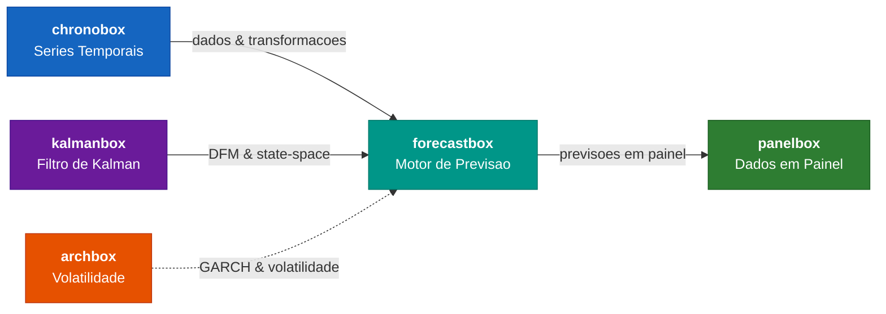

---
hide:
  - navigation
  - toc
---

# **forecastbox**

### Motor de previsao econometrica do ecossistema NodesEcon

[](https://pypi.org/project/forecastbox/)
[](https://pypi.org/project/forecastbox/)
[](https://github.com/nodesecon/forecastbox/blob/main/LICENSE)
[](https://nodesecon.github.io/forecastbox/)

**forecastbox** e o motor de previsao do ecossistema NodesEcon. Oferece auto-forecast
com selecao automatica de modelos, combinacao de previsoes por 7 metodos distintos,
testes estatisticos de avaliacao, cenarios condicionais, nowcasting em tempo real e
pipeline de producao com monitoramento.

---

## Capacidades

<div class="grid cards" markdown>

-   :material-auto-fix:{ .lg .middle } **Auto-Forecast**

    ---

    Selecao automatica de modelos com AutoARIMA, AutoETS, Theta e AutoVAR.
    Busca exaustiva ou stepwise com criterios de informacao.

    [:octicons-arrow-right-24: User Guide](user-guide/auto-forecast/index.md)

-   :material-set-merge:{ .lg .middle } **Combinacao**

    ---

    7 metodos de combinacao de previsoes: media simples, pesos fixos, OLS,
    stacking, BMA, time-varying e otima (Bates-Granger).

    [:octicons-arrow-right-24: User Guide](user-guide/combination/index.md)

-   :material-test-tube:{ .lg .middle } **Avaliacao**

    ---

    Testes estatisticos rigorosos: Diebold-Mariano, Model Confidence Set,
    Giacomini-White, Mincer-Zarnowitz e encompassing.

    [:octicons-arrow-right-24: User Guide](user-guide/evaluation/index.md)

-   :material-chart-timeline-variant:{ .lg .middle } **Cenarios**

    ---

    Previsao condicional, stress testing, simulacao Monte Carlo e fan charts
    para analise de risco e planejamento.

    [:octicons-arrow-right-24: User Guide](user-guide/scenarios/index.md)

-   :material-clock-fast:{ .lg .middle } **Nowcasting**

    ---

    Dynamic Factor Models (DFM), MIDAS e bridge equations para previsao
    em tempo real com dados de frequencias mistas.

    [:octicons-arrow-right-24: User Guide](user-guide/nowcasting/index.md)

-   :material-pipe:{ .lg .middle } **Pipeline**

    ---

    Producao automatizada com monitoramento de drift, re-estimacao
    programada e alertas de degradacao.

    [:octicons-arrow-right-24: User Guide](user-guide/pipeline/index.md)

</div>

---

## Quick Example

```python
from forecastbox import AutoForecast, combine, evaluate

# Auto-forecast com selecao automatica
model = AutoForecast(strategy="best")
forecast = model.fit_predict(y, horizon=12)

# Combinar multiplos modelos via BMA
combined = combine([model1, model2, model3], method="bma")

# Avaliar com teste Diebold-Mariano
dm_test = evaluate.diebold_mariano(actual, forecast1, forecast2)
print(dm_test)
```

!!! tip "Experiment Pattern"

    Para comparar multiplos modelos de uma vez, use o `ForecastExperiment`:

    ```python
    from forecastbox import ForecastExperiment

    exp = ForecastExperiment(
        data=data,
        target="ipca",
        models=["auto_arima", "auto_ets", "theta"],
        combination="bma",
        horizon=12,
    )
    results = exp.run()
    results.report("report.html")
    ```

---

## Ecossistema NodesEcon

O **forecastbox** integra-se com as demais bibliotecas do ecossistema NodesEcon,
cada uma responsavel por um dominio especifico da modelagem econometrica:



| Biblioteca | Papel | Dependencia |
|:-----------|:------|:------------|
| **chronobox** | Series temporais, transformacoes, sazonalidade | Obrigatoria |
| **kalmanbox** | Filtro de Kalman, DFM, state-space models | Nowcasting |
| **archbox** | Modelos GARCH, volatilidade condicional | Opcional |
| **panelbox** | Dados em painel, efeitos fixos/aleatorios | Consumidor |

---

## Instalacao

=== "Base"

    ```bash
    pip install forecastbox
    ```

    Inclui auto-forecast, combinacao, avaliacao e cenarios.

=== "Nowcasting"

    ```bash
    pip install forecastbox[nowcasting]
    ```

    Adiciona `kalmanbox` para DFM, bridge equations e MIDAS.

=== "Completa"

    ```bash
    pip install forecastbox[full]
    ```

    Todas as dependencias incluindo `archbox` para modelos de volatilidade.

!!! note "Requisitos"

    - Python >= 3.10
    - chronobox >= 0.1.0

Veja o [Guia de Instalacao](getting-started/installation.md) para mais detalhes.

---

## Navegacao

<div class="grid cards" markdown>

-   :material-rocket-launch:{ .lg .middle } **Getting Started**

    ---

    Instalacao, quickstart e conceitos fundamentais para comecar rapidamente.

    [:octicons-arrow-right-24: Comecar](getting-started/index.md)

-   :material-book-open-variant:{ .lg .middle } **User Guide**

    ---

    Guias detalhados de cada modulo: auto-forecast, combinacao, avaliacao,
    cenarios, nowcasting e pipeline.

    [:octicons-arrow-right-24: User Guide](user-guide/index.md)

-   :material-school:{ .lg .middle } **Tutorials**

    ---

    Tutoriais passo a passo com exemplos praticos e datasets reais.

    [:octicons-arrow-right-24: Tutorials](tutorials/index.md)

-   :material-api:{ .lg .middle } **API Reference**

    ---

    Documentacao completa de todas as classes, funcoes e parametros.

    [:octicons-arrow-right-24: API Reference](api/index.md)

</div>

---

## License

MIT License. See [LICENSE](https://github.com/nodesecon/forecastbox/blob/main/LICENSE).
