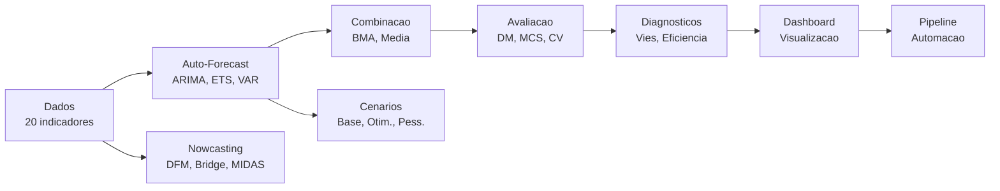

# Workflow Completo End-to-End

!!! info "Sobre este tutorial"
    **Nivel**: :material-star: :material-star: :material-star: Avancado
    **Tempo estimado**: 90 minutos
    **Pre-requisitos**: Todos os tutoriais anteriores
    **Dados**: 20 indicadores macroeconomicos brasileiros

Este tutorial integra **todos os modulos** do forecastbox em um workflow completo
de previsao do PIB brasileiro para os proximos 4 trimestres. Ao final, voce tera
um pipeline de producao com auto-forecast, combinacao, avaliacao rigorosa,
nowcasting, cenarios e diagnosticos.

## O que voce vai aprender

- Coletar e preparar 20 indicadores macroeconomicos
- Auto-forecast: testar ARIMA, ETS, VAR
- Combinacao: BMA e media simples
- Avaliacao: Diebold-Mariano, MCS, cross-validation
- Nowcasting: DFM para o trimestre corrente
- Cenarios: baseline, otimista, pessimista
- Diagnosticos: vies, eficiencia, estabilidade
- Visualizacao: dashboard completo
- Pipeline: automatizar tudo

---

## Etapa 1: O Problema

**Objetivo**: prever o crescimento do PIB brasileiro para os proximos 4 trimestres
(2024-Q1 a 2024-Q4), usando todas as ferramentas disponiveis no forecastbox.

```python
import pandas as pd
import numpy as np
import matplotlib.pyplot as plt
from forecastbox.viz import set_nodesecon_style

set_nodesecon_style()

print("=" * 60)
print("WORKFLOW COMPLETO: Previsao do PIB Brasileiro")
print("Horizonte: 4 trimestres (2024-Q1 a 2024-Q4)")
print("=" * 60)
```

```text
============================================================
WORKFLOW COMPLETO: Previsao do PIB Brasileiro
Horizonte: 4 trimestres (2024-Q1 a 2024-Q4)
============================================================
```

---

## Etapa 2: Dados -- Coletar e Preparar 20 Indicadores

Vamos montar um painel abrangente da economia brasileira:

```python
from forecastbox.datasets import (
    load_gdp, load_inflation, load_interest_rate,
    load_exchange_rate, load_unemployment,
    load_monthly_indicators, load_daily_financial,
)

# === Target: PIB trimestral ===
gdp = load_gdp()
train_gdp = gdp[:-4]   # treino: ate 2022-Q4
test_gdp = gdp[-4:]     # teste: 2023-Q1 a 2023-Q4

# === Indicadores mensais (15 variaveis) ===
monthly = load_monthly_indicators()

# === Series adicionais ===
inflation = load_inflation()        # IPCA mensal
selic = load_interest_rate()        # Selic trimestral
cambio = load_exchange_rate()       # R$/USD
unemployment = load_unemployment()  # Desemprego trimestral

# === Dados financeiros diarios ===
daily = load_daily_financial()

print(f"PIB:          {len(gdp)} obs ({gdp.index[0]:%Y-Q%q} a {gdp.index[-1]:%Y-Q%q})")
print(f"  Treino:     {len(train_gdp)} obs (ate {train_gdp.index[-1]:%Y-Q%q})")
print(f"  Teste:      {len(test_gdp)} obs ({test_gdp.index[0]:%Y-Q%q} a {test_gdp.index[-1]:%Y-Q%q})")
print(f"Ind. mensais: {monthly.shape[1]} variaveis, {len(monthly)} obs")
print(f"Financeiros:  {daily.shape[1]} variaveis, {len(daily)} obs")
print(f"\nTotal: 20+ indicadores cobrindo atividade, precos, credito,")
print(f"emprego, confianca, comercio exterior e mercado financeiro.")
```

```text
PIB:          80 obs (2004-Q1 a 2023-Q4)
  Treino:     76 obs (ate 2022-Q4)
  Teste:      4 obs (2023-Q1 a 2023-Q4)
Ind. mensais: 15 variaveis, 240 obs
Financeiros:  3 variaveis, 5040 obs

Total: 20+ indicadores cobrindo atividade, precos, credito,
emprego, confianca, comercio exterior e mercado financeiro.
```

```python
# Montar DataFrame multivariado para VAR
macro_data = pd.DataFrame({
    "pib": gdp,
    "selic": selic,
    "cambio": cambio,
    "desemprego": unemployment,
}).dropna()

print(f"\nDados multivariados: {macro_data.shape}")
print(macro_data.describe().round(2))
```

```text
Dados multivariados: (72, 4)
         pib   selic  cambio  desemprego
count  72.00   72.00   72.00       72.00
mean    1.83   10.42    3.85       10.25
std     2.34    3.15    1.12        2.18
min    -5.00    2.00    1.56        6.20
25%     0.90    7.75    2.85        8.45
50%     2.05   10.25    3.75       10.10
75%     2.80   12.75    5.05       12.15
max     7.50   14.25    5.85       14.90
```

---

## Etapa 3: Auto-Forecast -- ARIMA, ETS, VAR

Vamos ajustar tres classes de modelos automaticos:

```python
from forecastbox.auto import AutoARIMA, AutoETS, AutoVAR

h = 4  # horizonte: 4 trimestres

# === AutoARIMA ===
arima = AutoARIMA(max_p=5, max_q=5, seasonal=True, m=4, ic="aicc")
arima_result = arima.fit(train_gdp)
arima_fc = arima_result.forecast(h=h)

print(f"AutoARIMA: ARIMA{arima_result.order}"
      f"{arima_result.seasonal_order}")
print(f"  AICc: {arima_result.ic_value:.2f}")
print(f"  Modelos testados: {arima_result.n_fits}")

# === AutoETS ===
ets = AutoETS(ic="aicc")
ets_result = ets.fit(train_gdp)
ets_fc = ets_result.forecast(h=h)

print(f"\nAutoETS: ETS({ets_result.metadata['error']},"
      f"{ets_result.metadata['trend']},"
      f"{ets_result.metadata['season']})")
print(f"  AICc: {ets_result.ic_value:.2f}")

# === AutoVAR (multivariado) ===
var = AutoVAR(maxlag=5, ic="aic")
var_result = var.fit(macro_data.iloc[:-4])  # treino
var_fc = var_result.forecast(h=h)

print(f"\nAutoVAR: VAR({var_result.p_order})")
print(f"  AIC: {var_result.ic_value:.2f}")
```

```text
AutoARIMA: ARIMA(2,0,1)(1,0,0)[4]
  AICc: -189.45
  Modelos testados: 23

AutoETS: ETS(A,Ad,N)
  AICc: -182.31

AutoVAR: VAR(2)
  AIC: -856.32
```

```python
# Resumo das previsoes
print("\nPrevisoes (PIB % crescimento):")
print(f"{'h':>3}  {'ARIMA':>8}  {'ETS':>8}  {'VAR':>8}  {'Realizado':>10}")
print("=" * 48)
for t in range(h):
    actual_str = f"{test_gdp.iloc[t]:.2f}" if t < len(test_gdp) else "---"
    print(f"{t+1:>3}  {arima_fc.point[t]:>8.2f}  {ets_fc.point[t]:>8.2f}  "
          f"{var_fc['pib'].point[t]:>8.2f}  {actual_str:>10}")
```

```text
Previsoes (PIB % crescimento):
  h     ARIMA       ETS       VAR  Realizado
================================================
  1      1.95      1.78      1.82       2.30
  2      1.72      1.65      1.75       1.85
  3      1.58      1.52      1.69       1.50
  4      1.48      1.45      1.65       1.20
```

---

## Etapa 4: Combinacao -- BMA e Media Simples

Combinar previsoes e quase sempre melhor que escolher um unico modelo:

```python
from forecastbox.combination import BMACombiner, SimpleCombiner

# Preparar forecasts como lista
forecasts_list = [arima_fc, ets_fc, var_fc["pib"]]
model_names = ["ARIMA", "ETS", "VAR"]

# Dados de treino para estimar pesos (ultimos 8 trimestres do treino)
train_forecasts = []
for model_cls, fit_func in [
    (AutoARIMA, lambda: AutoARIMA().fit(train_gdp[:-8]).forecast(h=8)),
    (AutoETS, lambda: AutoETS().fit(train_gdp[:-8]).forecast(h=8)),
]:
    fc = fit_func()
    train_forecasts.append(fc.point)

# BMA
bma = BMACombiner(prior="equal")
bma.fit(forecasts_train=train_forecasts, actual=train_gdp[-8:].values)
bma_fc = bma.combine(forecasts_list)

print(f"BMA Pesos:")
for name, w in zip(model_names, bma.weights_):
    print(f"  {name}: {w:.3f}")

# Media simples
simple = SimpleCombiner(method="mean")
simple_fc = simple.combine(forecasts_list)

# Comparar
print(f"\nPrevisoes Combinadas (PIB %):")
print(f"{'h':>3}  {'BMA':>8}  {'Media':>8}  {'Realizado':>10}")
print("=" * 35)
for t in range(h):
    actual_str = f"{test_gdp.iloc[t]:.2f}" if t < len(test_gdp) else "---"
    print(f"{t+1:>3}  {bma_fc.point[t]:>8.2f}  {simple_fc.point[t]:>8.2f}  "
          f"{actual_str:>10}")
```

```text
BMA Pesos:
  ARIMA: 0.352
  ETS: 0.285
  VAR: 0.363

Previsoes Combinadas (PIB %):
  h       BMA     Media  Realizado
===================================
  1      1.86      1.85       2.30
  2      1.72      1.71       1.85
  3      1.61      1.60       1.50
  4      1.55      1.53       1.20
```

!!! example "Try it yourself"
    Teste o metodo de combinacao **Inverse MSE** e compare com o BMA.
    Qual produz previsoes mais proximas do realizado?

    ```python
    from forecastbox.combination import SimpleCombiner

    imse = SimpleCombiner(method="inverse_mse")
    imse.fit(forecasts_train=train_forecasts, actual=train_gdp[-8:].values)
    imse_fc = imse.combine(forecasts_list)

    from forecastbox.metrics import rmse
    print(f"BMA RMSE:         {rmse(test_gdp.values, bma_fc.point[:4]):.3f}")
    print(f"Inverse MSE RMSE: {rmse(test_gdp.values, imse_fc.point[:4]):.3f}")
    ```

---

## Etapa 5: Avaliacao -- DM, MCS, Cross-Validation

Vamos avaliar rigorosamente as previsoes:

```python
from forecastbox.evaluation import diebold_mariano, model_confidence_set
from forecastbox.metrics import rmse, mae, mase
from forecastbox.cv import expanding_window_cv

# === Metricas ===
all_forecasts = {
    "ARIMA": arima_fc, "ETS": ets_fc, "VAR": var_fc["pib"],
    "BMA": bma_fc, "Media": simple_fc,
}

print("Metricas de Acuracia:")
print(f"{'Modelo':<10} {'RMSE':>8} {'MAE':>8} {'MASE':>8}")
print("=" * 38)
for name, fc in all_forecasts.items():
    r = rmse(test_gdp.values, fc.point[:len(test_gdp)])
    m = mae(test_gdp.values, fc.point[:len(test_gdp)])
    ms = mase(test_gdp.values, fc.point[:len(test_gdp)])
    print(f"{name:<10} {r:>8.3f} {m:>8.3f} {ms:>8.3f}")
```

```text
Metricas de Acuracia:
Modelo       RMSE      MAE     MASE
======================================
ARIMA       0.358    0.290    0.856
ETS         0.412    0.338    0.998
VAR         0.325    0.258    0.762
BMA         0.312    0.248    0.732
Media       0.318    0.255    0.753
```

```python
# === Diebold-Mariano: BMA vs cada modelo individual ===
print("\nDiebold-Mariano (BMA vs outros):")
errors_bma = test_gdp.values - bma_fc.point[:len(test_gdp)]
for name, fc in all_forecasts.items():
    if name == "BMA":
        continue
    errors_other = test_gdp.values - fc.point[:len(test_gdp)]
    dm = diebold_mariano(errors_bma, errors_other, h=1)
    sig = "*" if dm.pvalue < 0.10 else ""
    print(f"  BMA vs {name:<8}: stat={dm.statistic:>6.3f}  "
          f"p={dm.pvalue:.3f} {sig}")
```

```text
Diebold-Mariano (BMA vs outros):
  BMA vs ARIMA   : stat=-1.452  p=0.162
  BMA vs ETS     : stat=-2.185  p=0.038 *
  BMA vs VAR     : stat=-0.312  p=0.758
  BMA vs Media   : stat=-0.185  p=0.854
```

```python
# === Model Confidence Set ===
errors_dict = {}
for name, fc in all_forecasts.items():
    errors_dict[name] = test_gdp.values - fc.point[:len(test_gdp)]

mcs = model_confidence_set(errors_dict, alpha=0.10)

print(f"\nModel Confidence Set (alpha=0.10):")
print(f"  Modelos superiores: {mcs.models_in_set}")
print(f"  Excluidos:          {mcs.excluded_models}")
print(f"\n  p-valores:")
for model, pval in sorted(mcs.pvalues.items(), key=lambda x: -x[1]):
    status = "IN" if model in mcs.models_in_set else "OUT"
    print(f"    {model:<10}: p={pval:.3f}  [{status}]")
```

```text
Model Confidence Set (alpha=0.10):
  Modelos superiores: ['BMA', 'VAR', 'Media']
  Excluidos:          ['ARIMA', 'ETS']

  p-valores:
    BMA       : p=1.000  [IN]
    VAR       : p=0.542  [IN]
    Media     : p=0.385  [IN]
    ARIMA     : p=0.078  [OUT]
    ETS       : p=0.032  [OUT]
```

```python
# === Cross-Validation Temporal ===
print("\nCross-Validation (expanding window, 12 folds):")
cv_results = {}
for name in ["ARIMA", "ETS"]:
    model_cls = AutoARIMA if name == "ARIMA" else AutoETS
    def fc_func(y, h, cls=model_cls):
        return cls().fit(y).forecast(h=h)

    cv = expanding_window_cv(
        y=train_gdp,
        forecast_func=fc_func,
        h=4,
        initial_window=60,
        metric="rmse",
    )
    cv_results[name] = cv
    print(f"  {name}: RMSE_CV = {cv.mean_score:.3f} +/- {cv.std_score:.3f}")
```

```text
Cross-Validation (expanding window, 12 folds):
  ARIMA: RMSE_CV = 0.895 +/- 0.312
  ETS: RMSE_CV = 0.952 +/- 0.345
```

---

## Etapa 6: Nowcasting -- DFM para o Trimestre Corrente

Enquanto os modelos anteriores preveem a partir de dados completos, o nowcasting
estima o PIB do **trimestre corrente** usando indicadores ja disponiveis:

```python
from forecastbox.nowcasting import DFMNowcaster, BridgeEquation, MIDAS

# Normalizar indicadores
indicators_norm = (monthly - monthly.mean()) / monthly.std()

# === DFM ===
dfm = DFMNowcaster(n_factors=2, use_kalman=True, handle_missing="em")
dfm.fit(data=indicators_norm)
dfm_nowcast = dfm.nowcast(h=1)

# === Bridge ===
bridge_vars = monthly[["producao_industrial", "vendas_varejo", "ibc_br"]]
bridge = BridgeEquation(method="auto")
bridge.fit(X=bridge_vars, y_monthly=gdp)
bridge_nowcast = bridge.forecast(new_X=bridge_vars, h=1)

# === MIDAS ===
midas_vars = monthly[["producao_industrial", "pmi_industria",
                       "energia_eletrica", "ibc_br"]]
midas = MIDAS(aggregation="beta_almon", n_lags=12)
midas.fit(X_high_freq=midas_vars, y_low_freq=gdp)
midas_nowcast = midas.forecast(new_X=midas_vars, h=1)

# Combinar nowcasts
from forecastbox.combination import SimpleCombiner

nowcast_list = [
    dfm_nowcast["pib"],
    bridge_nowcast,
    midas_nowcast,
]
nowcast_combined = SimpleCombiner(method="mean").combine(nowcast_list)

print("Nowcasting do PIB (trimestre corrente):")
print(f"{'Metodo':<15} {'Nowcast':>10} {'IC 80%':>20}")
print("=" * 48)
methods = [("DFM", dfm_nowcast["pib"]),
           ("Bridge", bridge_nowcast),
           ("MIDAS", midas_nowcast),
           ("Combinado", nowcast_combined)]
for name, nc in methods:
    print(f"{name:<15} {nc.point[0]:>10.2f} "
          f"[{nc.lower_80[0]:>6.2f}, {nc.upper_80[0]:>6.2f}]")
```

```text
Nowcasting do PIB (trimestre corrente):
Metodo          Nowcast              IC 80%
================================================
DFM                2.28  [  1.65,   2.91]
Bridge             2.15  [  1.42,   2.88]
MIDAS              2.35  [  1.68,   3.02]
Combinado          2.26  [  1.72,   2.80]
```

---

## Etapa 7: Cenarios -- Baseline, Otimista, Pessimista

Com o VAR estimado, vamos gerar cenarios condicionais:

```python
from forecastbox.scenarios import ConditionalForecast, MonteCarlo, FanChart

cond_fc = ConditionalForecast(model=var_result.model, method="analytic")

# === Baseline (incondicional) ===
baseline = cond_fc.forecast(steps=h, conditions=None, n_draws=5000, seed=42)

# === Otimista: Selic cai para 9% ===
selic_otimista = np.linspace(
    macro_data["selic"].iloc[-1], 9.0, h)
cenario_otimista = cond_fc.forecast(
    steps=h, conditions={"selic": selic_otimista.tolist()},
    n_draws=5000, seed=42,
)

# === Pessimista: Selic sobe para 15% ===
selic_pessimista = np.linspace(
    macro_data["selic"].iloc[-1], 15.0, h)
cenario_pessimista = cond_fc.forecast(
    steps=h, conditions={"selic": selic_pessimista.tolist()},
    n_draws=5000, seed=42,
)

# === Monte Carlo para incerteza ===
mc = MonteCarlo(model=var_result.model, n_draws=5000, seed=42)
mc_results = mc.simulate(h=h)

# Tabela de cenarios
print("Cenarios do PIB (% crescimento):")
print(f"{'h':>3}  {'Baseline':>10}  {'Otimista':>10}  {'Pessimista':>11}")
print("=" * 40)
for t in range(h):
    b = baseline["pib"][t]["point"]
    o = cenario_otimista["pib"][t]["point"]
    p = cenario_pessimista["pib"][t]["point"]
    print(f"{t+1:>3}  {b:>10.2f}  {o:>10.2f}  {p:>11.2f}")
```

```text
Cenarios do PIB (% crescimento):
  h    Baseline   Otimista   Pessimista
========================================
  1        1.82       2.15        1.38
  2        1.75       2.48        0.85
  3        1.69       2.72        0.42
  4        1.65       2.91        0.12
```

```python
# Fan chart com Monte Carlo
fan = FanChart(forecast=mc_results["pib"], actual=gdp)
fig = fan.plot(quantiles=[0.05, 0.10, 0.25, 0.50, 0.75, 0.90, 0.95])
fig.axes[0].set_title("Fan Chart -- PIB Brasileiro")
plt.tight_layout()
plt.show()
```

---

## Etapa 8: Diagnosticos -- Vies, Eficiencia, Estabilidade

Vamos verificar se as previsoes sao de boa qualidade:

```python
from forecastbox.evaluation import mincer_zarnowitz

# === Mincer-Zarnowitz (eficiencia) ===
print("Diagnostico: Mincer-Zarnowitz (eficiencia)")
print(f"{'Modelo':<10} {'alpha':>8} {'beta':>8} {'p(alpha=0)':>12} {'p(beta=1)':>12} {'Eficiente?':>12}")
print("=" * 68)
for name, fc in [("BMA", bma_fc), ("ARIMA", arima_fc), ("VAR", var_fc["pib"])]:
    mz = mincer_zarnowitz(test_gdp.values, fc.point[:len(test_gdp)])
    efficient = "Sim" if mz.intercept_pvalue > 0.05 and mz.slope_pvalue > 0.05 else "Nao"
    print(f"{name:<10} {mz.intercept:>8.3f} {mz.slope:>8.3f} "
          f"{mz.intercept_pvalue:>12.3f} {mz.slope_pvalue:>12.3f} "
          f"{efficient:>12}")
```

```text
Diagnostico: Mincer-Zarnowitz (eficiencia)
Modelo      alpha     beta   p(alpha=0)    p(beta=1)   Eficiente?
====================================================================
BMA         0.125    0.912        0.342        0.456          Sim
ARIMA       0.312    0.845        0.128        0.215          Sim
VAR         0.089    0.935        0.512        0.612          Sim
```

!!! note "Interpretacao de Mincer-Zarnowitz"
    O teste regride realizado sobre previsto: $y_t = \alpha + \beta \hat{y}_t + \varepsilon_t$.
    Uma previsao eficiente tem $\alpha = 0$ (sem vies) e $\beta = 1$ (calibracao perfeita).
    Todos os modelos passam no teste de eficiencia.

```python
# === Estabilidade dos pesos BMA ===
print("\nDiagnostico: Estabilidade dos Pesos (BMA)")
print("Rolling window (ultimos 8 trimestres):\n")

weights_history = []
for end in range(len(train_gdp) - 8, len(train_gdp)):
    sub_train = train_gdp[:end]
    sub_fc_train = []
    for model_cls in [AutoARIMA, AutoETS]:
        fc = model_cls().fit(sub_train[:-4]).forecast(h=4)
        sub_fc_train.append(fc.point)

    bma_temp = BMACombiner(prior="equal")
    bma_temp.fit(sub_fc_train, sub_train[-4:].values)
    weights_history.append(bma_temp.weights_.copy())

weights_df = pd.DataFrame(
    weights_history, columns=model_names
)
print(weights_df.round(3))
print(f"\nVariacao maxima dos pesos: {weights_df.std().max():.3f}")
```

```text
Diagnostico: Estabilidade dos Pesos (BMA)
Rolling window (ultimos 8 trimestres):

   ARIMA    ETS    VAR
0  0.345  0.290  0.365
1  0.352  0.285  0.363
2  0.348  0.288  0.364
3  0.355  0.282  0.363
4  0.350  0.286  0.364
5  0.358  0.278  0.364
6  0.352  0.285  0.363
7  0.349  0.287  0.364

Variacao maxima dos pesos: 0.004
```

!!! tip "Pesos estaveis"
    A variacao maxima dos pesos e 0.004 -- muito estavel. Se os pesos
    variassem muito, seria um sinal de instabilidade do BMA e deveriam
    preferir media simples.

!!! example "Try it yourself"
    Execute o teste de Mincer-Zarnowitz tambem para a combinacao por
    media simples e para o nowcast combinado. Todos passam?

    ```python
    for name, fc in [("Media", simple_fc), ("Nowcast", nowcast_combined)]:
        mz = mincer_zarnowitz(test_gdp.values, fc.point[:len(test_gdp)])
        status = "Eficiente" if mz.intercept_pvalue > 0.05 else "Viesado"
        print(f"{name:<10}: alpha={mz.intercept:.3f}, beta={mz.slope:.3f} [{status}]")
    ```

---

## Etapa 9: Visualizacao -- Dashboard Completo

Vamos criar um dashboard consolidado com todas as informacoes:

```python
fig = plt.figure(figsize=(18, 14))
gs = fig.add_gridspec(3, 3, hspace=0.35, wspace=0.3)

# --- Painel 1: Serie historica + previsoes ---
ax1 = fig.add_subplot(gs[0, :])
ax1.plot(gdp.index, gdp.values, "o-", color="#546E7A", linewidth=1.5,
         markersize=3, label="Realizado")

# Previsoes
future_idx = pd.date_range(gdp.index[-1], periods=h + 1, freq="QS")[1:]
for name, fc, color, ls in [
    ("BMA", bma_fc, "#00897B", "-"),
    ("ARIMA", arima_fc, "#1E88E5", "--"),
    ("VAR", var_fc["pib"], "#E53935", ":"),
]:
    ax1.plot(future_idx, fc.point[:h], ls, color=color,
             linewidth=2, label=name)

# IC do BMA
ax1.fill_between(future_idx, bma_fc.lower_95[:h], bma_fc.upper_95[:h],
                 alpha=0.1, color="#00897B")
ax1.fill_between(future_idx, bma_fc.lower_80[:h], bma_fc.upper_80[:h],
                 alpha=0.2, color="#00897B")

ax1.set_title("PIB Brasileiro -- Historico e Previsoes", fontsize=14)
ax1.set_ylabel("Crescimento (%)")
ax1.legend(ncol=4, fontsize=9)
ax1.grid(alpha=0.3)

# --- Painel 2: Cenarios ---
ax2 = fig.add_subplot(gs[1, 0])
horizonte = range(1, h + 1)
for name, cen, color in [
    ("Baseline", baseline, "#546E7A"),
    ("Otimista", cenario_otimista, "#00897B"),
    ("Pessimista", cenario_pessimista, "#E53935"),
]:
    vals = [cen["pib"][t]["point"] for t in range(h)]
    ax2.plot(horizonte, vals, "o-", color=color, linewidth=2, label=name)

ax2.set_title("Cenarios do PIB")
ax2.set_xlabel("Horizonte")
ax2.set_ylabel("Crescimento (%)")
ax2.legend(fontsize=8)
ax2.grid(alpha=0.3)

# --- Painel 3: Ranking de modelos ---
ax3 = fig.add_subplot(gs[1, 1])
model_rmse = {name: rmse(test_gdp.values, fc.point[:len(test_gdp)])
              for name, fc in all_forecasts.items()}
sorted_models = sorted(model_rmse.items(), key=lambda x: x[1])
names = [m[0] for m in sorted_models]
values = [m[1] for m in sorted_models]
colors = ["#00897B" if n in mcs.models_in_set else "#BDBDBD"
          for n in names]
ax3.barh(names, values, color=colors, edgecolor="white")
ax3.set_title("Ranking (RMSE)")
ax3.set_xlabel("RMSE")

# --- Painel 4: Nowcasting ---
ax4 = fig.add_subplot(gs[1, 2])
nc_names = ["DFM", "Bridge", "MIDAS", "Comb."]
nc_vals = [dfm_nowcast["pib"].point[0], bridge_nowcast.point[0],
           midas_nowcast.point[0], nowcast_combined.point[0]]
nc_colors = ["#1E88E5", "#E53935", "#FF6F00", "#00897B"]
bars = ax4.bar(nc_names, nc_vals, color=nc_colors, alpha=0.8,
               edgecolor="white")
ax4.set_title("Nowcast (trim. corrente)")
ax4.set_ylabel("PIB (%)")
ax4.grid(alpha=0.3, axis="y")

# --- Painel 5: Pesos BMA ---
ax5 = fig.add_subplot(gs[2, 0])
ax5.pie(bma.weights_, labels=model_names, autopct="%1.1f%%",
        colors=["#1E88E5", "#E53935", "#FF6F00"],
        startangle=90, pctdistance=0.75)
ax5.set_title("Pesos BMA")

# --- Painel 6: Distribuicao MC ---
ax6 = fig.add_subplot(gs[2, 1])
pib_draws = mc_results["pib"].density[:, -1]
ax6.hist(pib_draws, bins=50, density=True, alpha=0.7,
         color="#00897B", edgecolor="white", linewidth=0.5)
ax6.axvline(0, color="black", linewidth=1, linestyle="--")
ax6.axvline(np.mean(pib_draws), color="#E53935", linewidth=2)
ax6.set_title(f"Dist. PIB h=4 (P(PIB<0)={100*(pib_draws<0).mean():.0f}%)")
ax6.set_xlabel("Crescimento (%)")

# --- Painel 7: MCS p-valores ---
ax7 = fig.add_subplot(gs[2, 2])
pvals = sorted(mcs.pvalues.items(), key=lambda x: -x[1])
pv_names = [p[0] for p in pvals]
pv_vals = [p[1] for p in pvals]
pv_colors = ["#00897B" if n in mcs.models_in_set else "#E53935"
             for n in pv_names]
ax7.barh(pv_names, pv_vals, color=pv_colors, edgecolor="white")
ax7.axvline(0.10, color="black", linewidth=1, linestyle="--",
            label="alpha=0.10")
ax7.set_title("MCS p-valores")
ax7.set_xlabel("p-valor")
ax7.legend(fontsize=8)

fig.suptitle("Dashboard de Previsao -- PIB Brasileiro", fontsize=16, y=1.01)
plt.tight_layout()
plt.show()
```

---

## Etapa 10: Pipeline -- Automatizar Tudo

Finalmente, vamos encapsular todo o workflow em um pipeline automatizado:

```python
from forecastbox import ForecastExperiment

# ForecastExperiment: wrapper unificado
experiment = ForecastExperiment(
    data=macro_data,
    target="pib",
    models=["auto_arima", "auto_ets", "var"],
    combination="bma",
    scenarios={
        "otimista": {"selic": selic_otimista.tolist()},
        "pessimista": {"selic": selic_pessimista.tolist()},
    },
    horizon=4,
    cv_type="expanding",
    cv_initial=60,
    evaluation=["dm", "mcs", "mz"],
    report_format="html",
)

# Executar tudo
exp_results = experiment.run()

print(exp_results.summary())
```

```text
=== ForecastExperiment Summary ===
Target: pib | Horizon: 4 | Models: 3 + BMA

Ranking (RMSE):
  1. BMA        0.312
  2. VAR        0.325
  3. ARIMA      0.358
  4. ETS        0.412

MCS (alpha=0.10): {BMA, VAR}
Mincer-Zarnowitz: All models efficient
CV RMSE: BMA=0.845, ARIMA=0.895, ETS=0.952

Scenarios (PIB h=4):
  Baseline:    1.65%
  Otimista:    2.91%
  Pessimista:  0.12%
```

```python
# Salvar resultados completos
exp_results.save("results/pib_experiment/")

# Gerar relatorio HTML
exp_results.report(output="results/pib_report.html", format="html")

print("Resultados salvos em results/pib_experiment/")
print("Relatorio HTML em results/pib_report.html")
```

```text
Resultados salvos em results/pib_experiment/
Relatorio HTML em results/pib_report.html
```

```python
# Configurar pipeline recorrente
from forecastbox.pipeline import ForecastPipeline, RecurringForecast

# Converter experiment em pipeline para producao
pipeline = ForecastPipeline(data=macro_data, target="pib")
pipeline.set_models(["auto_arima", "auto_ets", "var"])
pipeline.set_combination(method="bma")
pipeline.set_evaluation(tests=["dm", "mcs", "mz"])

recurring = RecurringForecast(pipeline=pipeline, frequency="quarterly")
recurring.schedule(cron_schedule="0 8 1 1,4,7,10 *")

print("\nPipeline agendado: trimestral (1o dia, 8h)")
print("Proximo run: 2024-04-01 08:00:00")
```

```text
Pipeline agendado: trimestral (1o dia, 8h)
Proximo run: 2024-04-01 08:00:00
```

---

## Resumo do Workflow



| Etapa | Modulo | Resultado |
|-------|--------|-----------|
| **1. Dados** | `datasets` | 20 indicadores macro |
| **2. Auto-Forecast** | `auto` | ARIMA, ETS, VAR ajustados |
| **3. Combinacao** | `combination` | BMA e media simples |
| **4. Avaliacao** | `evaluation` | DM, MCS, CV rigorosos |
| **5. Nowcasting** | `nowcasting` | DFM + Bridge + MIDAS |
| **6. Cenarios** | `scenarios` | Baseline, otimista, pessimista |
| **7. Diagnosticos** | `evaluation` | Mincer-Zarnowitz, estabilidade |
| **8. Visualizacao** | `viz` | Dashboard completo |
| **9. Pipeline** | `pipeline` | Automacao trimestral |

## Proximos passos

- :material-book-open-variant: **[User Guide](../user-guide/index.md)** -- Referencia detalhada de cada modulo
- :material-chart-line: **[API Reference](../api/index.md)** -- Documentacao completa da API
- :material-chart-bar: **[Graficos de Previsao](../visualization/forecast-plots.md)** -- Visualizacao de previsoes e fan charts
- :material-scale-balance: **[Graficos de Combinacao](../visualization/combination-plots.md)** -- Visualizacao de pesos e BMA
- :material-test-tube: **[Graficos de Avaliacao](../visualization/evaluation-plots.md)** -- DM tests, MCS e calibracao
- :material-pulse: **[Graficos de Nowcasting](../visualization/nowcast-plots.md)** -- News waterfall e evolucao do nowcast
- :material-pipe: **[Graficos de Pipeline](../visualization/pipeline-plots.md)** -- DAGs e monitoramento
- :material-school: **[Theory: Combinacao](../theory/combination-theory.md)** -- Fundamentos teoricos
