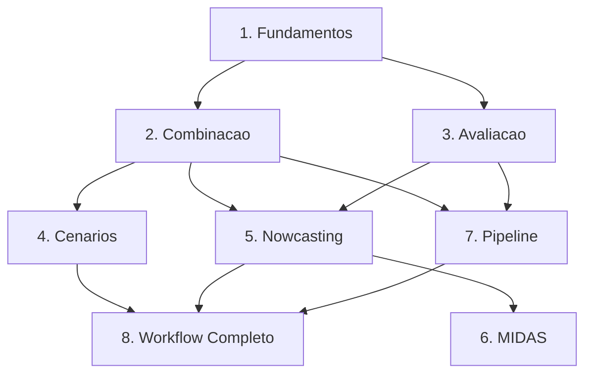

# Tutorials

O forecastbox oferece **8 tutoriais interativos** organizados por nivel de dificuldade,
cobrindo desde fundamentos de previsao ate workflows completos de producao. Cada tutorial
e self-contained com dados de exemplo e codigo executavel.

!!! tip "Quick Start"
    Novo no forecastbox? Comece pelo tutorial de [Fundamentos](fundamentals.md)
    para aprender o basico, depois explore o topico que voce precisa.

## Learning Paths

Escolha um caminho baseado nos seus objetivos e nivel de experiencia:

| Path | Nivel | Duracao | Topicos | Tutoriais |
|------|-------|---------|---------|-----------|
| **Essencial** | Iniciante | 1--2 horas | Fundamentos, metricas basicas | 1 |
| **Aplicado** | Intermediario | 3--4 horas | + Combinacao, Avaliacao | 3 |
| **Completo** | Avancado | 8--10 horas | + Cenarios, Nowcasting, MIDAS, Pipeline | 8 |

### :material-school: Path Essencial (1--2 horas)

Para quem esta comecando com previsao econometrica ou com o forecastbox.

1. [Fundamentos de Previsao](fundamentals.md) -- AutoARIMA, AutoETS, metricas basicas

### :material-flask: Path Aplicado (3--4 horas)

Para pesquisadores prontos para aplicar tecnicas avancadas de combinacao e avaliacao.

1. Complete o path **Essencial** primeiro
2. [Combinacao de Previsoes](combination.md) -- 5 metodos de combinacao, diagnosticos de pesos
3. [Avaliacao Rigorosa](evaluation.md) -- Diebold-Mariano, MCS, cross-validation temporal

### :material-trophy: Path Completo (8--10 horas)

O curriculo completo do forecastbox. Domine todas as funcionalidades.

1. Complete o path **Aplicado** primeiro
2. [Cenarios e Previsao Condicional](scenarios.md) -- Scenario Builder, Monte Carlo, stress testing
3. [Nowcasting](nowcasting.md) -- DFM, Bridge Equations, news decomposition
4. [MIDAS](midas.md) -- Dados de frequencias mistas
5. [Pipeline de Producao](pipeline.md) -- Automacao, monitoramento, alertas
6. [Workflow Completo](complete-workflow.md) -- Projeto end-to-end

---

## Tabela de Tutoriais

| # | Tutorial | Nivel | Tempo | Pre-requisitos |
|---|----------|-------|-------|----------------|
| 1 | [Fundamentos de Previsao](fundamentals.md) | :material-star: Iniciante | 30 min | Python, pandas |
| 2 | [Combinacao de Previsoes](combination.md) | :material-star: :material-star: Intermediario | 45 min | Tutorial 1 |
| 3 | [Avaliacao Rigorosa](evaluation.md) | :material-star: :material-star: Intermediario | 45 min | Tutorial 1 |
| 4 | [Cenarios e Previsao Condicional](scenarios.md) | :material-star: :material-star: Intermediario | 45 min | Tutorial 2 |
| 5 | [Nowcasting](nowcasting.md) | :material-star: :material-star: :material-star: Avancado | 60 min | Tutoriais 1--3 |
| 6 | [MIDAS](midas.md) | :material-star: :material-star: :material-star: Avancado | 45 min | Tutorial 5 |
| 7 | [Pipeline de Producao](pipeline.md) | :material-star: :material-star: :material-star: Avancado | 60 min | Tutoriais 1--3 |
| 8 | [Workflow Completo](complete-workflow.md) | :material-star: :material-star: :material-star: Avancado | 90 min | Todos anteriores |

---

## Tutorial Categories

<div class="grid cards" markdown>

-   :material-school: **Fundamentos**

    ---

    AutoARIMA, AutoETS, Forecast container, metricas basicas, visualizacao

    **Nivel**: Iniciante | **Tempo**: 30 min

    [:octicons-arrow-right-24: Fundamentos](fundamentals.md)

-   :material-set-merge: **Combinacao**

    ---

    Media simples, Inverse MSE, OLS, BMA, diagnostico de pesos

    **Nivel**: Intermediario | **Tempo**: 45 min

    [:octicons-arrow-right-24: Combinacao](combination.md)

-   :material-test-tube: **Avaliacao**

    ---

    Diebold-Mariano, MCS, cross-validation, Mincer-Zarnowitz

    **Nivel**: Intermediario | **Tempo**: 45 min

    [:octicons-arrow-right-24: Avaliacao](evaluation.md)

-   :material-arrow-decision: **Cenarios**

    ---

    Previsao condicional, Scenario Builder, Monte Carlo, stress testing

    **Nivel**: Intermediario | **Tempo**: 45 min

    [:octicons-arrow-right-24: Cenarios](scenarios.md)

-   :material-pulse: **Nowcasting**

    ---

    DFM, Bridge Equations, news decomposition, vintages

    **Nivel**: Avancado | **Tempo**: 60 min

    [:octicons-arrow-right-24: Nowcasting](nowcasting.md)

-   :material-chart-timeline-variant: **MIDAS**

    ---

    Frequencias mistas, U-MIDAS, MIDAS com dados financeiros

    **Nivel**: Avancado | **Tempo**: 45 min

    [:octicons-arrow-right-24: MIDAS](midas.md)

-   :material-pipe: **Pipeline**

    ---

    Automacao, monitoramento, alertas, producao

    **Nivel**: Avancado | **Tempo**: 60 min

    [:octicons-arrow-right-24: Pipeline](pipeline.md)

-   :material-rocket-launch: **Workflow Completo**

    ---

    Projeto end-to-end: dados, modelos, combinacao, avaliacao, deploy

    **Nivel**: Avancado | **Tempo**: 90 min

    [:octicons-arrow-right-24: Workflow Completo](complete-workflow.md)

</div>

---

## Como Usar os Tutoriais

=== "Local (Recomendado)"

    Instale o forecastbox e execute os exemplos diretamente:

    ```bash
    pip install forecastbox
    python
    ```

    Todos os dados de exemplo estao incluidos no pacote -- nao e necessario
    download adicional.

=== "Jupyter Notebook"

    Copie os blocos de codigo para celulas de um notebook:

    ```bash
    pip install forecastbox jupyter
    jupyter lab
    ```

    Cada etapa do tutorial funciona como uma celula independente.

## Niveis de Dificuldade

| Nivel | Descricao | Pre-requisitos |
|-------|-----------|----------------|
| **Iniciante** | Nenhuma experiencia previa com previsao necessaria. Cobre fundamentos e modelos basicos. | Python, pandas, estatistica basica |
| **Intermediario** | Assume conhecimento basico de previsao. Introduce tecnicas avancadas e diagnosticos. | Tutorial de Fundamentos completado |
| **Avancado** | Para usuarios experientes. Modelos complexos, workflows customizados e producao. | Multiplos tutoriais completados |

---

## Ordem de Leitura Recomendada



## See Also

- [Getting Started](../getting-started/index.md) -- Instalacao e primeiros passos
- [User Guide](../user-guide/index.md) -- Referencia completa de todos os metodos
- [Visualization](../visualization/index.md) -- Graficos prontos para publicacao
- [Theory](../theory/combination-theory.md) -- Fundamentos teoricos
- [API Reference](../api/index.md) -- Documentacao completa da API
