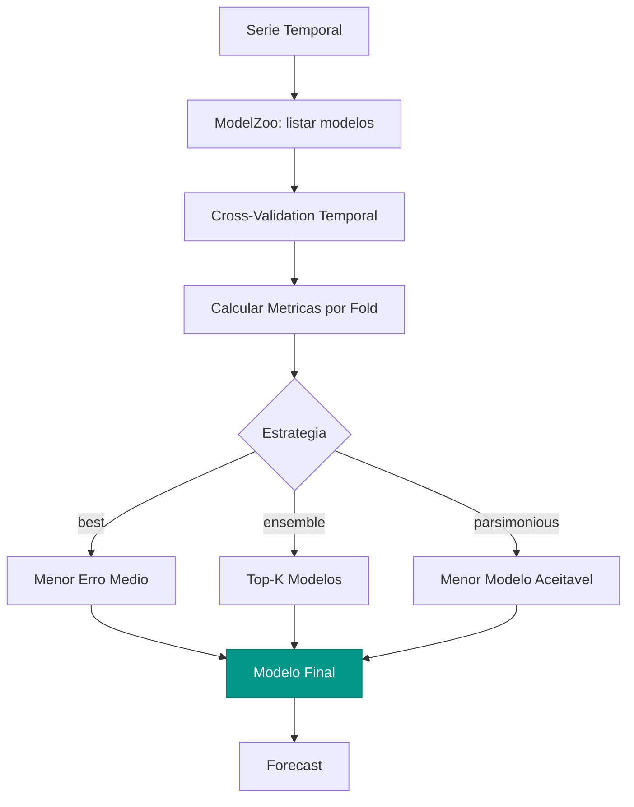

# AutoSelect

O `AutoSelect` compara **todos os modelos registrados** no ModelZoo e seleciona o
melhor (ou um ensemble dos melhores) usando cross-validation temporal. Em vez de
escolher manualmente entre ARIMA, ETS, Theta ou outros, o AutoSelect automatiza
essa decisao.

---

## Como Funciona

O AutoSelect executa o seguinte fluxo:



---

## Estrategias de Selecao

### `best` — Menor Erro

Seleciona o modelo com a menor metrica de erro media nos folds de cross-validation:

$$
\hat{m}^* = \arg\min_{m \in \mathcal{M}} \frac{1}{K} \sum_{k=1}^{K} L(m, \text{fold}_k)
$$

onde $\mathcal{M}$ e o conjunto de modelos candidatos, $K$ o numero de folds e
$L$ a funcao de perda (RMSE, MAE, MAPE, etc.).

```python
from forecastbox.auto import AutoSelect

model = AutoSelect(
    strategy="best",
    metric="rmse",
    cv_folds=5,
)
model.fit(y)
```

### `ensemble` — Top-K Modelos

Combina as previsoes dos $k$ melhores modelos. Os pesos podem ser iguais ou
inversamente proporcionais ao erro:

$$
\hat{y}_{t+h} = \sum_{i=1}^{k} w_i \hat{y}_{t+h}^{(i)}, \quad w_i = \frac{1/L_i}{\sum_{j=1}^{k} 1/L_j}
$$

```python
model = AutoSelect(
    strategy="ensemble",
    top_k=3,
    ensemble_weights="inverse_error",
    metric="mape",
    cv_folds=5,
)
model.fit(y)
```

!!! tip "Ensemble Robusto"

    Na pratica, o ensemble dos top-3 modelos frequentemente supera o melhor modelo
    individual, especialmente em series com mudancas de regime. A combinacao
    reduz o risco de escolher um modelo que funciona bem no passado mas nao
    no futuro.

### `parsimonious` — Menor Modelo Aceitavel

Seleciona o modelo mais simples (menos parametros) cujo erro nao e significativamente
pior que o melhor modelo. Usa o teste de Diebold-Mariano para comparar:

$$
H_0: L(\hat{m}_{\text{simples}}) = L(\hat{m}^*) \quad \text{vs} \quad H_1: L(\hat{m}_{\text{simples}}) > L(\hat{m}^*)
$$

```python
model = AutoSelect(
    strategy="parsimonious",
    significance=0.05,
    metric="rmse",
    cv_folds=5,
)
model.fit(y)
```

!!! info "Quando ser Parcimonioso"

    A estrategia `parsimonious` e util em producao, onde modelos menores sao mais
    rapidos e estaveis. Se um Naive Sazonal tem erro estatisticamente equivalente
    a um ARIMA(2,1,3)(1,1,1)[12], prefira o Naive.

---

## Cross-Validation Temporal

O AutoSelect usa **expanding window** ou **sliding window** para avaliar cada modelo:

```text
Expanding Window (padrao):
  Fold 1: [========train========|test]
  Fold 2: [==========train==========|test]
  Fold 3: [============train============|test]
  Fold 4: [==============train==============|test]
  Fold 5: [================train================|test]

Sliding Window:
  Fold 1: [========train========|test]
  Fold 2:   [========train========|test]
  Fold 3:     [========train========|test]
  Fold 4:       [========train========|test]
  Fold 5:         [========train========|test]
```

```python
model = AutoSelect(
    cv_folds=5,
    cv_method="expanding",  # ou "sliding"
    cv_horizon=12,          # tamanho do conjunto de teste
    cv_step=6,              # passo entre folds
)
```

!!! warning "Cuidado com Poucos Dados"

    A cross-validation temporal requer dados suficientes para treinar e testar em
    cada fold. Para series curtas ($n < 60$ observacoes mensais), use menos folds
    (2-3) ou avalie com criterios de informacao em vez de CV.

---

## Parametros

| Parametro | Tipo | Default | Descricao |
|:----------|:-----|:--------|:----------|
| `strategy` | `str` | `"best"` | Estrategia: `"best"`, `"ensemble"`, `"parsimonious"` |
| `models` | `list[str] \| None` | `None` | Modelos a comparar (ex: `["arima", "ets", "theta"]`). `None` usa todos do ModelZoo |
| `metric` | `str` | `"rmse"` | Metrica de erro: `"rmse"`, `"mae"`, `"mape"`, `"smape"`, `"mase"` |
| `cv_folds` | `int` | `5` | Numero de folds de cross-validation |
| `cv_method` | `str` | `"expanding"` | Metodo de CV: `"expanding"` ou `"sliding"` |
| `cv_horizon` | `int \| None` | `None` | Horizonte de teste em cada fold. `None` usa o horizonte de previsao |
| `cv_step` | `int \| None` | `None` | Passo entre folds. `None` calcula automaticamente |
| `top_k` | `int` | `3` | Numero de modelos no ensemble (estrategia `"ensemble"`) |
| `ensemble_weights` | `str` | `"inverse_error"` | Pesos do ensemble: `"equal"` ou `"inverse_error"` |
| `significance` | `float` | `0.05` | Significancia do teste Diebold-Mariano (estrategia `"parsimonious"`) |
| `seasonal` | `bool` | `True` | Incluir modelos sazonais |
| `m` | `int` | `1` | Periodo sazonal |
| `n_jobs` | `int` | `1` | Paralelismo na avaliacao |

---

## Exemplo: Comparar ARIMA vs ETS vs Theta vs Naive

### Ajuste e Selecao

```python
import pandas as pd
from forecastbox.auto import AutoSelect

# Carregar serie mensal
y = pd.read_csv("ipca_mensal.csv", index_col="date", parse_dates=True)["ipca"]

# Comparar modelos com cross-validation temporal
model = AutoSelect(
    models=["arima", "ets", "theta", "naive", "seasonal_naive"],
    strategy="best",
    metric="rmse",
    cv_folds=5,
    seasonal=True,
    m=12,
)
model.fit(y)

print(model.summary())
```

```text
AutoSelect Summary
==================
Strategy: best | Metric: RMSE | CV Folds: 5
Seasonal: True (m=12)

Ranking:
  #   Model              RMSE    MAE     MAPE   Params  Time(s)
  1   AutoETS            0.342   0.271   2.81%     14    1.23
  2   AutoARIMA          0.348   0.279   2.89%     7     3.45
  3   Theta              0.361   0.288   2.98%     2     0.12
  4   SeasonalNaive      0.412   0.334   3.46%     0     0.01
  5   Naive              0.587   0.482   5.01%     0     0.01

Best Model: AutoETS — ETS(M,Ad,M)
```

### Tabela de Ranking

```python
# Tabela detalhada com metricas por fold
results = model.results_table_
print(results)
```

```text
Model           Fold1   Fold2   Fold3   Fold4   Fold5   Mean    Std
AutoETS         0.312   0.378   0.345   0.328   0.347   0.342   0.024
AutoARIMA       0.321   0.389   0.351   0.334   0.345   0.348   0.026
Theta           0.334   0.402   0.367   0.348   0.354   0.361   0.026
SeasonalNaive   0.378   0.456   0.412   0.389   0.425   0.412   0.030
Naive           0.534   0.623   0.589   0.567   0.622   0.587   0.038
```

### Previsao com o Melhor Modelo

```python
# Prever com o modelo selecionado
forecast = model.predict(horizon=12, level=[80, 95])
print(f"Modelo selecionado: {model.best_model_}")
print(forecast.head())
```

```text
Modelo selecionado: AutoETS — ETS(M,Ad,M)
             point     lo80     hi80     lo95     hi95
2024-01      0.52     0.31     0.73     0.20     0.84
2024-02      0.48     0.24     0.72     0.11     0.85
2024-03      0.45     0.18     0.72     0.04     0.86
2024-04      0.51     0.21     0.81     0.05     0.97
2024-05      0.47     0.14     0.80    -0.03     0.97
```

---

## Exemplo: Ensemble dos Top-3

```python
model = AutoSelect(
    models=["arima", "ets", "theta", "naive", "seasonal_naive"],
    strategy="ensemble",
    top_k=3,
    ensemble_weights="inverse_error",
    metric="mape",
    cv_folds=5,
    seasonal=True,
    m=12,
)
model.fit(y)

print(model.summary())
```

```text
AutoSelect Summary (Ensemble)
=============================
Strategy: ensemble (top_k=3) | Metric: MAPE | CV Folds: 5

Ensemble Composition:
  #   Model         MAPE    Weight
  1   AutoETS       2.81%   0.387
  2   AutoARIMA     2.89%   0.376
  3   Theta         2.98%   0.237

Ensemble MAPE (CV): 2.64%  ← menor que qualquer modelo individual
```

!!! tip "Ensemble vs Best"

    Neste exemplo, o ensemble (MAPE 2.64%) superou o melhor modelo individual
    (AutoETS, MAPE 2.81%). Isso e tipico — a combinacao dilui os erros
    idiossincraticos de cada modelo.

---

## Metricas Disponiveis

| Metrica | Formula | Escala | Uso |
|:--------|:--------|:-------|:----|
| **RMSE** | $\sqrt{\frac{1}{h}\sum(y_t - \hat{y}_t)^2}$ | Mesma da serie | Padrao, penaliza erros grandes |
| **MAE** | $\frac{1}{h}\sum|y_t - \hat{y}_t|$ | Mesma da serie | Robusta a outliers |
| **MAPE** | $\frac{100}{h}\sum\left|\frac{y_t - \hat{y}_t}{y_t}\right|$ | Percentual | Comparavel entre series |
| **sMAPE** | $\frac{200}{h}\sum\frac{|y_t - \hat{y}_t|}{|y_t| + |\hat{y}_t|}$ | Percentual | Simetrica |
| **MASE** | $\frac{\text{MAE}}{\text{MAE}_{\text{naive}}}$ | Adimensional | Relativa ao Naive |

!!! info "Escolha da Metrica"

    - Use **RMSE** como padrao — penaliza erros grandes, adequada para decisoes de custo quadratico
    - Use **MAPE** para comunicar resultados a stakeholders (intuitivo)
    - Use **MASE** para comparar series com escalas diferentes (ex: PIB vs inflacao)
    - Evite **MAPE** para series com valores proximos de zero (inflacao baixa, taxas)

---

## Proximos Passos

- **[ModelZoo](model-zoo.md)** — registre modelos customizados para usar no AutoSelect
- **[AutoARIMA](auto-arima.md)** — detalhes do algoritmo AutoARIMA
- **[AutoETS](auto-ets.md)** — detalhes do algoritmo AutoETS
- **[Combinacao](../combination/index.md)** — metodos avancados de combinacao de previsoes
