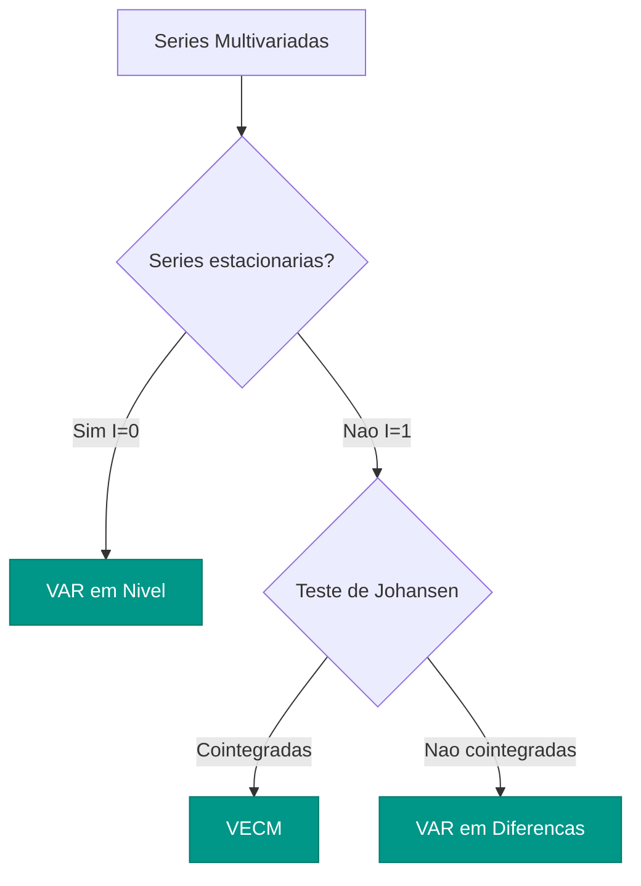

# AutoVAR

O `AutoVAR` seleciona automaticamente a ordem $p$ de um modelo **VAR** (Vector
Autoregression) para series temporais multivariadas. Inclui testes de cointegracacao
(Johansen) para decidir entre VAR e VECM, funcoes impulso-resposta (IRF) e
decomposicao de variancia (FEVD).

---

## Modelo VAR(p)

Um modelo VAR(p) descreve a dinamica conjunta de $K$ series temporais como funcao
de seus proprios valores passados:

$$
\mathbf{y}_t = \mathbf{c} + \mathbf{A}_1 \mathbf{y}_{t-1} + \mathbf{A}_2 \mathbf{y}_{t-2} + \cdots + \mathbf{A}_p \mathbf{y}_{t-p} + \mathbf{u}_t
$$

onde:

| Simbolo | Descricao |
|:--------|:----------|
| $\mathbf{y}_t$ | Vetor $K \times 1$ de variaveis endogenas no tempo $t$ |
| $\mathbf{c}$ | Vetor $K \times 1$ de constantes (intercepto) |
| $\mathbf{A}_i$ | Matriz $K \times K$ de coeficientes para o lag $i$ |
| $\mathbf{u}_t$ | Vetor $K \times 1$ de erros $\sim N(\mathbf{0}, \boldsymbol{\Sigma}_u)$ |
| $p$ | Ordem do VAR (numero de defasagens) |

Para $K = 3$ variaveis (PIB, inflacao, juros), o VAR(1) tem a forma:

$$
\begin{pmatrix} \text{pib}_t \\ \text{inf}_t \\ \text{jur}_t \end{pmatrix}
= \begin{pmatrix} c_1 \\ c_2 \\ c_3 \end{pmatrix}
+ \begin{pmatrix} a_{11} & a_{12} & a_{13} \\ a_{21} & a_{22} & a_{23} \\ a_{31} & a_{32} & a_{33} \end{pmatrix}
\begin{pmatrix} \text{pib}_{t-1} \\ \text{inf}_{t-1} \\ \text{jur}_{t-1} \end{pmatrix}
+ \begin{pmatrix} u_{1t} \\ u_{2t} \\ u_{3t} \end{pmatrix}
$$

!!! info "Quando usar VAR"

    O VAR e adequado quando as variaveis se influenciam mutuamente ao longo do tempo.
    Em macroeconomia, PIB, inflacao e juros sao naturalmente interdependentes —
    o banco central ajusta juros em resposta a inflacao, que por sua vez afeta o PIB.

---

## Selecao Automatica de Ordem

O `AutoVAR` determina a ordem $p$ otima comparando criterios de informacao para
diferentes ordens candidatas ($p = 1, 2, \ldots, p_{\max}$):

### Criterios de Informacao

$$
\text{AIC}(p) = \ln|\hat{\boldsymbol{\Sigma}}_u(p)| + \frac{2pK^2}{T}
$$

$$
\text{BIC}(p) = \ln|\hat{\boldsymbol{\Sigma}}_u(p)| + \frac{pK^2 \ln T}{T}
$$

$$
\text{HQ}(p) = \ln|\hat{\boldsymbol{\Sigma}}_u(p)| + \frac{2pK^2 \ln(\ln T)}{T}
$$

onde $|\hat{\boldsymbol{\Sigma}}_u(p)|$ e o determinante da matriz de covariancia
dos residuos, $K$ e o numero de variaveis e $T$ o tamanho da amostra.

| Criterio | Penalizacao | Tendencia |
|:---------|:-----------|:----------|
| **AIC** | Leve | Seleciona modelos maiores, melhor para previsao |
| **BIC** | Forte | Seleciona modelos menores, consistente |
| **HQ** | Intermediaria | Compromisso entre AIC e BIC |

---

## Teste de Cointegracacao (Johansen)

Quando as series sao $I(1)$ (nao estacionarias), o `AutoVAR` aplica o teste de
Johansen para verificar se existe uma relacao de equilibrio de longo prazo
(cointegracacao) entre elas.

### VAR vs VECM



O VECM (Vector Error Correction Model) estende o VAR incorporando o termo de
correcao de erros:

$$
\Delta \mathbf{y}_t = \boldsymbol{\Pi} \mathbf{y}_{t-1} + \sum_{i=1}^{p-1} \boldsymbol{\Gamma}_i \Delta \mathbf{y}_{t-i} + \mathbf{u}_t
$$

onde $\boldsymbol{\Pi} = \boldsymbol{\alpha}\boldsymbol{\beta}'$ contem as velocidades
de ajuste ($\boldsymbol{\alpha}$) e os vetores de cointegracacao ($\boldsymbol{\beta}$).

!!! warning "Cointegracacao Muda o Modelo"

    Se o teste de Johansen detectar $r > 0$ relacoes de cointegracacao, o `AutoVAR`
    automaticamente estima um VECM em vez de um VAR em diferencas. Ignorar a
    cointegracacao leva a perda de informacao e previsoes ineficientes.

### Parametro `cointegration_test`

=== "Trace (padrao)"

    Testa $H_0$: existem no maximo $r$ vetores de cointegracacao.

    ```python
    var = AutoVAR(cointegration_test="trace")
    ```

=== "Max Eigenvalue"

    Testa $H_0$: existem exatamente $r$ vetores contra $r+1$.

    ```python
    var = AutoVAR(cointegration_test="max_eig")
    ```

---

## Parametros

| Parametro | Tipo | Default | Descricao |
|:----------|:-----|:--------|:----------|
| `max_lags` | `int` | `8` | Numero maximo de defasagens a testar |
| `ic` | `str` | `"aic"` | Criterio de informacao: `"aic"`, `"bic"`, `"hqic"` |
| `trend` | `str` | `"c"` | Tendencia deterministica: `"n"` (nenhuma), `"c"` (constante), `"ct"` (constante + tendencia), `"ctt"` (constante + tendencia quadratica) |
| `cointegration_test` | `str \| None` | `"trace"` | Teste de Johansen: `"trace"`, `"max_eig"` ou `None` (desabilitar) |
| `significance` | `float` | `0.05` | Nivel de significancia para testes |
| `season` | `int \| None` | `None` | Dummies sazonais (ex: 4 para trimestral, 12 para mensal) |
| `n_jobs` | `int` | `1` | Paralelismo na estimacao |

---

## Funcoes Impulso-Resposta (IRF)

A funcao impulso-resposta mostra o efeito de um choque unitario em uma variavel
sobre todas as variaveis do sistema ao longo do tempo.

### IRF Ortogonalizada

A ortogonalizacao via decomposicao de Cholesky garante que os choques sejam
nao correlacionados:

$$
\mathbf{u}_t = \mathbf{P}\boldsymbol{\varepsilon}_t, \quad \mathbf{P}\mathbf{P}' = \boldsymbol{\Sigma}_u
$$

onde $\mathbf{P}$ e a matriz triangular inferior da decomposicao de Cholesky e
$\boldsymbol{\varepsilon}_t$ sao choques estruturais nao correlacionados.

```python
# Funcoes impulso-resposta ortogonalizadas
irf = model.irf(periods=24)
irf.plot(impulse="juros", response=["pib", "inflacao"])
```

!!! info "Ordenacao de Cholesky"

    A ortogonalizacao de Cholesky depende da **ordenacao das variaveis**. A
    variavel mais exogena deve vir primeiro. Para modelos macro, uma ordenacao
    comum e: PIB → inflacao → juros (do mais lento ao mais rapido).

### Decomposicao de Variancia (FEVD)

A FEVD mostra a proporcao da variancia do erro de previsao de cada variavel
explicada por choques em cada uma das variaveis do sistema:

```python
# Decomposicao de variancia
fevd = model.fevd(periods=24)
fevd.plot()
```

```text
FEVD - PIB (horizonte 12):
  PIB:      72.3%
  Inflacao: 15.1%
  Juros:    12.6%

FEVD - Inflacao (horizonte 12):
  PIB:       8.4%
  Inflacao:  68.7%
  Juros:     22.9%
```

---

## Causalidade de Granger

O teste de causalidade de Granger verifica se os valores passados de uma variavel
ajudam a prever outra variavel, condicionando nas demais:

$$
H_0: \text{variavel } j \text{ nao Granger-causa variavel } i
$$

```python
# Teste de causalidade de Granger
granger = model.granger_causality()
print(granger)
```

```text
Granger Causality Tests (p=2)
=================================
Causa       → Efeito       F-stat  p-value
inflacao    → pib          4.23    0.018  **
juros       → pib          6.81    0.002  ***
pib         → inflacao     2.15    0.124
juros       → inflacao     8.94    <0.001 ***
pib         → juros        3.47    0.036  **
inflacao    → juros        5.62    0.005  ***
```

!!! tip "Interpretacao"

    Causalidade de Granger nao implica causalidade no sentido estrito. Ela indica
    que os valores passados de uma variavel contem informacao util para prever
    outra. E um teste de **precedencia temporal**, nao de causalidade estrutural.

---

## Exemplo: VAR para PIB, Inflacao e Juros

### Ajuste do Modelo

```python
import pandas as pd
from forecastbox.auto import AutoVAR

# Carregar series trimestrais
data = pd.read_csv("macro_trimestral.csv", index_col="date", parse_dates=True)
data = data[["pib", "inflacao", "juros"]]

# Ajustar AutoVAR com selecao automatica de ordem
model = AutoVAR(
    max_lags=8,
    ic="aic",
    trend="c",
    cointegration_test="trace",
)
model.fit(data)

print(model.summary())
```

```text
AutoVAR Summary
===============
Variables: pib, inflacao, juros (K=3)
Selected: VAR(2) — AIC
Observations: 120 (trimestral)
Cointegration: Johansen trace — 1 relation (VECM not needed: series are I(0))

Lag Selection:
  Lag    AIC        BIC        HQ
  1     -12.345    -12.012    -12.213
  2     -12.567    -12.001    -12.341   ← selected
  3     -12.534    -11.735    -12.215
  4     -12.489    -11.457    -12.076

Stability: All eigenvalues inside unit circle ✓
Autocorrelation (LM test, lag 4): p=0.312 ✓
Normality (Jarque-Bera): p=0.087 ✓
```

### Previsao Multivariada

```python
# Previsao 8 trimestres a frente
forecast = model.predict(horizon=8, level=95)
print(forecast)
```

```text
            pib_point  pib_lo95  pib_hi95  inf_point  inf_lo95  inf_hi95  jur_point  jur_lo95  jur_hi95
2024-Q1       2.31      1.12      3.50      4.12      2.87      5.37     10.75      9.21     12.29
2024-Q2       2.18      0.67      3.69      4.05      2.41      5.69     10.62      8.54     12.70
2024-Q3       2.24      0.42      4.06      3.98      1.97      5.99     10.48      7.91     13.05
2024-Q4       2.15      0.11      4.19      3.91      1.58      6.24     10.35      7.33     13.37
...
```

### Diagnosticos de Estabilidade

O VAR e estavel se todas as raizes caracteristicas estao dentro do circulo unitario:

```python
# Verificar estabilidade
model.plot_stability()
print(f"Estavel: {model.is_stable_}")
```

```text
Raizes Caracteristicas (modulo):
  0.912, 0.912, 0.743, 0.743, 0.456, 0.456
  Todas dentro do circulo unitario ✓
```

!!! warning "Instabilidade"

    Se alguma raiz estiver fora ou sobre o circulo unitario, o VAR e instavel
    e as previsoes podem divergir. Isso pode indicar:

    - Ordem $p$ excessiva (sobre-parametrizacao)
    - Necessidade de diferenciar as series
    - Presenca de cointegracacao (usar VECM)

### Diagnosticos de Residuos

```python
# Testes de diagnostico multivariados
diag = model.diagnostics()
print(diag)
```

```text
Residual Diagnostics (VAR(2))
=============================
Autocorrelation:
  Portmanteau(12):     Q=48.3,  p=0.234 ✓
  Breusch-Godfrey(4):  LM=12.1, p=0.287 ✓

Normality:
  Jarque-Bera (joint): JB=8.4, p=0.087 ✓
  Skewness:            chi2=3.2, p=0.362
  Kurtosis:            chi2=5.2, p=0.157

Heteroscedasticity:
  ARCH-LM(4):          chi2=15.3, p=0.412 ✓
```

---

## VAR vs ARIMA Univariado

| Aspecto | VAR | ARIMA |
|:--------|:----|:------|
| **Dimensao** | Multivariado ($K$ series) | Univariado (1 serie) |
| **Interacoes** | Captura relacoes cruzadas | Ignora outras variaveis |
| **Parametros** | $K^2 \times p$ coeficientes | $p + q$ coeficientes |
| **Dados necessarios** | Mais dados para estimar | Menos exigente |
| **Interpretacao** | IRF, FEVD, Granger | ACF/PACF, diagnosticos |
| **Melhor para** | Sistemas de variaveis inter-relacionadas | Series isoladas ou poucos dados |

!!! tip "Parcimonia"

    O VAR tem $K^2 p$ coeficientes — para $K=5$ variaveis e $p=4$ lags,
    sao 100 parametros. Use poucas variaveis (3-7) e lags moderados.
    Considere o BIC para favorecer modelos mais parcimoniosos.

---

## Proximos Passos

- **[AutoSelect](auto-select.md)** — selecao automatica entre todos os modelos (univariados e multivariados)
- **[AutoARIMA](auto-arima.md)** — selecao automatica de modelos ARIMA univariados
- **[Combinacao](../combination/index.md)** — combine previsoes de VAR com modelos univariados
