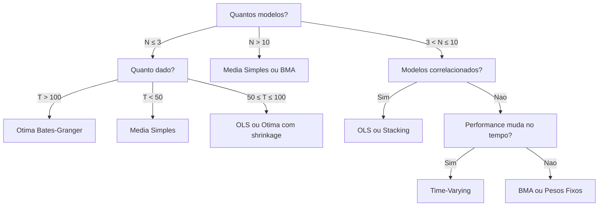

# Escolhendo o Metodo de Combinacao

Com tantos metodos disponiveis, escolher o certo pode parecer dificil. Este guia
oferece **regras praticas** baseadas em decadas de pesquisa empirica para ajudar
na decisao.

---

## Fluxograma de Decisao



---

## Regras de Ouro

Baseadas na literatura empirica (Timmermann 2006, Genre et al. 2013, Smith & Wallis 2009):

### 1. Ratio N/T

A relacao entre numero de modelos ($N$) e observacoes ($T$) e o fator mais importante:

| Ratio $N/T$ | Recomendacao | Motivo |
|:-------------|:-------------|:-------|
| $> 0.3$ | **Media simples** ou BMA | Muitos parametros para pouco dado; estimacao instavel |
| $0.1 - 0.3$ | OLS com regularizacao ou Stacking | Regularizacao controla overfitting |
| $< 0.1$ | Otima, OLS, ou Stacking | Dados suficientes para estimar pesos confiavelmente |

!!! tip "A Regra mais Importante"

    **Na duvida, use media simples.** Decadas de pesquisa empirica mostram que a
    media simples e surpreendentemente dificil de bater de forma consistente.
    Metodos sofisticados so compensam com dados suficientes e modelos realmente
    heterogeneos.

### 2. Correlacao entre Modelos

| Correlacao dos Erros | Recomendacao | Motivo |
|:---------------------|:-------------|:-------|
| Baixa ($\rho < 0.3$) | Media simples | Diversificacao ja e eficiente |
| Moderada ($0.3 - 0.7$) | Otima ou OLS | Explora estrutura de correlacao |
| Alta ($\rho > 0.7$) | Stacking ou Lasso | Seleciona modelos; elimina redundancia |

### 3. Mudanca Estrutural

| Estabilidade | Recomendacao | Motivo |
|:-------------|:-------------|:-------|
| Estavel | Qualquer metodo com pesos fixos | Nao ha necessidade de adaptacao |
| Mudanca gradual | Time-varying (Kalman ou forgetting) | Pesos se adaptam continuamente |
| Quebras abruptas | Time-varying (regime-switching) | Detecta e responde a mudancas de regime |

### 4. Poucos Modelos vs Muitos Modelos

| Cenario | Recomendacao | Motivo |
|:--------|:-------------|:-------|
| $N = 2$ | Otima (Bates-Granger) | So 1 peso a estimar; shrinkage quase desnecessario |
| $N = 3-5$ | OLS ou Stacking | Regularizacao ajuda com poucos parametros |
| $N = 5-10$ | Stacking ou BMA | Selecao implicita de modelos e importante |
| $N > 10$ | Media simples ou BMA | Estimacao de $N$ pesos e impraticavel com pouco dado |

---

## Tabela de Referencia Rapida

| Metodo | N Modelos | T Minimo | Mudanca Estrutural | Interpretabilidade | Complexidade |
|:-------|:----------|:---------|:-------------------|:-------------------|:-------------|
| [Media Simples](simple.md) | Qualquer | Nenhum | :material-close: | :material-star: :material-star: :material-star: | Nenhuma |
| [Pesos Fixos](weighted.md) | Qualquer | Nenhum | :material-close: | :material-star: :material-star: :material-star: | Baixa |
| [OLS](ols.md) | $\leq 10$ | $10N$ | :material-close: | :material-star: :material-star: | Moderada |
| [Stacking](stacking.md) | $\leq 20$ | $20N$ | :material-close: | :material-star: :material-star: | Moderada |
| [BMA](bma.md) | Qualquer | $30+$ | :material-close: | :material-star: :material-star: :material-star: | Moderada |
| [Time-Varying](time-varying.md) | $\leq 10$ | $50+$ | :material-check: | :material-star: | Alta |
| [Otima](optimal.md) | $\leq 5$ | $50+$ | :material-close: | :material-star: :material-star: | Moderada |

---

## Benchmark Empirico

Resultados tipicos da literatura (baseados em meta-analises de previsao macroeconomica):

### Performance Relativa ao Melhor Modelo Individual

| Metodo | RMSE Relativo | Vence Melhor Individual | Observacoes |
|:-------|:--------------|:-----------------------|:------------|
| Media Simples | 0.92 | 78% das vezes | Baseline robusto |
| Pesos Inv-MSE | 0.91 | 80% | Leve melhora sobre media |
| OLS (v1) | 0.89 | 75% | Risco de overfitting |
| OLS + Ridge | 0.87 | 82% | Regularizacao estabiliza |
| Stacking (Ridge) | 0.86 | 84% | CV temporal protege |
| BMA | 0.88 | 81% | Robusto, bons intervalos |
| Otima (shrinkage) | 0.87 | 80% | Depende da estimacao de $\Sigma$ |
| Otima (MLE) | 0.95 | 65% | Frequentemente perde para media simples! |
| Time-Varying | 0.85 | 83% | Melhor em periodos de instabilidade |

!!! warning "Forecast Combination Puzzle"

    Note que a combinacao otima sem shrinkage (MLE) e frequentemente **pior** que a
    media simples. Este e o *forecast combination puzzle* — metodos teoricamente
    otimos perdem para o baseline mais simples quando a estimacao dos parametros
    e ruidosa.

### Licoes do Benchmark

1. **Combinar sempre ajuda** — qualquer metodo de combinacao tipicamente vence o melhor modelo individual
2. **Simplicidade e robusta** — media simples esta consistentemente entre os melhores
3. **Regularizacao e essencial** — OLS e otima sem regularizacao sao instaveis
4. **Time-varying brilha em instabilidade** — mas pode overfit em periodos estaveis
5. **BMA e o melhor "meio-termo"** — robusto, interpretavel, e com intervalos honestos

---

## Exemplos

### Selecao Automatica de Metodo

```python
import pandas as pd
from forecastbox.auto import AutoARIMA, AutoETS
from forecastbox.models import Theta, TBATS
from forecastbox.combine import combine

# Dados
y = pd.read_csv("ipca.csv", index_col="date", parse_dates=True)["ipca"]
y_train = y[:"2023-06"]
y_test = y["2023-07":"2023-12"]

# Ajustar modelos
arima = AutoARIMA(seasonal=True, m=12).fit(y_train)
ets = AutoETS(seasonal_periods=12).fit(y_train)
theta = Theta().fit(y_train)
tbats = TBATS(seasonal_periods=[12]).fit(y_train)

fc_arima = arima.predict(horizon=6)
fc_ets = ets.predict(horizon=6)
fc_theta = theta.predict(horizon=6)
fc_tbats = tbats.predict(horizon=6)

forecasts = [fc_arima, fc_ets, fc_theta, fc_tbats]

# Selecao automatica baseada em N/T
fc_auto = combine(
    forecasts=forecasts,
    method="auto",  # seleciona automaticamente
)
print(fc_auto.summary())
```

```text
Combination Summary
===================
Method: auto -> BMA (selected)
Reason: N=4, T=120, N/T=0.033

Selection Logic:
  N/T = 0.033 (< 0.1) -> eligible: optimal, ols, stacking, bma
  No structural break detected -> fixed weights preferred
  Selected: BMA (robust default for 3 < N <= 10)

Posterior Model Probabilities:
  arima    0.412
  ets      0.298
  theta    0.187
  tbats    0.103
```

### Comparacao Head-to-Head

```python
# Comparacao sistematica de todos os metodos
methods = {
    "Media Simples": {"method": "simple"},
    "Inv-MSE": {"method": "weighted", "weighting": "inv_mse"},
    "OLS (v1)": {"method": "ols", "variant": 1},
    "OLS + Ridge": {"method": "ols", "variant": 3, "regularization": "ridge"},
    "Stacking": {"method": "stacking", "meta_learner": "ridge"},
    "BMA": {"method": "bma"},
    "Otima (LW)": {"method": "optimal", "shrinkage": "ledoit_wolf"},
}

print(f"{'Metodo':20s}  {'RMSE':>8s}  {'MAE':>8s}")
print("-" * 40)

for name, params in methods.items():
    fc = combine(forecasts=forecasts, **params)
    rmse = fc.evaluate(y_test, metric="rmse")
    mae = fc.evaluate(y_test, metric="mae")
    print(f"{name:20s}  {rmse:8.4f}  {mae:8.4f}")
```

```text
Metodo                    RMSE       MAE
----------------------------------------
Media Simples           0.3891    0.3124
Inv-MSE                 0.3812    0.3067
OLS (v1)                0.3654    0.2945
OLS + Ridge             0.3521    0.2834
Stacking                0.3412    0.2756
BMA                     0.3578    0.2878
Otima (LW)              0.3562    0.2867
```

---

## Arvore de Decisao Simplificada

Para quem quer uma resposta rapida:

1. **Primeiro projeto?** → Media simples
2. **Quer algo melhor mas simples?** → BMA ou Pesos Inv-MSE
3. **Tem bastante dado ($T > 100$)?** → Stacking com Ridge
4. **Suspeita de mudanca estrutural?** → Time-Varying com forgetting
5. **Apenas 2 modelos?** → Otima (Bates-Granger) com shrinkage

---

## Proximos Passos

- **[Media Simples](simple.md)** — comece pelo baseline
- **[Stacking](stacking.md)** — o metodo mais flexivel
- **[BMA](bma.md)** — o melhor meio-termo

---

## Ver Tambem

- :material-stethoscope: [Estabilidade de Pesos](../../diagnostics/weight-stability.md) — diagnostico de estabilidade temporal dos pesos de combinacao
- :material-stethoscope: [Encompassing Test](../../diagnostics/encompassing-test.md) — verificar se modelos agregam informacao antes de combinar
- [Combinacao — Media Simples](simple.md) — alternativa robusta a instabilidade de pesos

## Referencias

- **Bates, J.M. & Granger, C.W.J.** (1969). "The Combination of Forecasts." *Operational Research Quarterly*, 20(4), 451-468.
- **Raftery, A.E., Madigan, D. & Hoeting, J.A.** (1997). "Bayesian Model Averaging for Linear Regression Models." *Journal of the American Statistical Association*, 92(437), 179-191.
- **Timmermann, A.** (2006). "Forecast Combinations." *Handbook of Economic Forecasting*, Vol. 1, 135-196.
- **Smith, J. & Wallis, K.F.** (2009). "A Simple Explanation of the Forecast Combination Puzzle." *Oxford Bulletin of Economics and Statistics*, 71(3), 331-355.
- **Genre, V., Kenny, G., Meyler, A. & Timmermann, A.** (2013). "Combining Expert Forecasts: Can Anything Beat the Simple Average?" *International Journal of Forecasting*, 29(1), 108-121.
