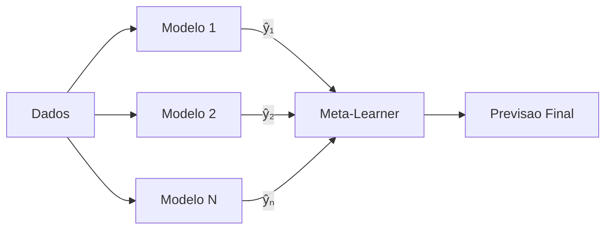

# Stacking (Meta-Learning)

Stacking e uma tecnica de **meta-learning** que trata as previsoes dos modelos base como
features de entrada para um segundo modelo (meta-learner). Ao inves de combinar previsoes
com pesos fixos, o stacking aprende uma funcao nao-linear que mapeia previsoes individuais
para a previsao final.

---

## Arquitetura

O stacking opera em duas camadas:

### Level 0: Modelos Base

Os modelos individuais geram previsoes independentes:

$$
\hat{y}^{(1)}_t, \hat{y}^{(2)}_t, \ldots, \hat{y}^{(N)}_t
$$

### Level 1: Meta-Learner

Um segundo modelo aprende a combinar as previsoes do Level 0:

$$
\hat{y}^{c}_t = g\!\left(\hat{y}^{(1)}_t, \ldots, \hat{y}^{(N)}_t;\; \hat{\theta}\right)
$$

onde $g(\cdot)$ e o meta-learner e $\hat{\theta}$ sao seus parametros estimados.



!!! info "Stacking vs OLS"

    O stacking com Ridge como meta-learner e conceitualmente similar a combinacao
    OLS com regularizacao Ridge. A diferenca-chave e o uso de **validacao cruzada
    temporal** para gerar as previsoes de treino, o que reduz overfitting.

---

## Cross-Validation para Evitar Data Leakage

O ponto critico do stacking e: as previsoes usadas para treinar o meta-learner **nao
podem** ser geradas nos mesmos dados usados para treinar os modelos base. Usar previsoes
in-sample causa data leakage severo.

A solucao e gerar **out-of-fold predictions** via validacao cruzada temporal:

1. Dividir o historico em $K$ folds temporais
2. Para cada fold $k$, treinar os modelos base nos folds anteriores
3. Gerar previsoes para o fold $k$ (out-of-fold)
4. Concatenar todas as previsoes out-of-fold
5. Treinar o meta-learner nessas previsoes

$$
\hat{y}^{(i)}_{t \in \text{fold}_k} = f_i\!\left(\text{dados}_{t \notin \text{fold}_k}\right)
$$

!!! warning "Data Leakage"

    Sem validacao cruzada, o meta-learner ve previsoes in-sample dos modelos base,
    que sao artificialmente boas. Isso leva a **overfitting severo** — o stacking
    parecera excelente in-sample mas falhara out-of-sample.

---

## Meta-Learners Disponiveis

| Meta-Learner | Descricao | Quando Usar |
|:-------------|:----------|:------------|
| `"ridge"` | Regressao Ridge (L2) | Default; robusto, bom para modelos correlacionados |
| `"lasso"` | Regressao Lasso (L1) | Selecao automatica de modelos; poucos modelos relevantes |
| `"rf"` | Random Forest | Relacoes nao-lineares entre previsoes |
| `"gbm"` | Gradient Boosting | Maximo poder preditivo; risco de overfitting |

### Escolhendo o Meta-Learner

=== "Ridge (Recomendado)"

    - Combinacao linear com regularizacao
    - Robusto mesmo com poucos dados
    - Interpretavel (pesos dos modelos)
    - **Melhor escolha para a maioria dos cenarios**

=== "Lasso"

    - Produz pesos esparsos (elimina modelos fracos)
    - Util quando muitos modelos sao redundantes
    - Menos estavel que Ridge com poucos dados

=== "Random Forest"

    - Captura interacoes nao-lineares entre previsoes
    - Ex: "usar modelo A quando modelo B preve alto"
    - Requer mais dados para treinar adequadamente

=== "Gradient Boosting"

    - Maior capacidade de aprendizado
    - Melhor com `use_features=True` (features originais)
    - **Cuidado**: alto risco de overfitting com poucos dados

---

## Parametros

| Parametro | Tipo | Default | Descricao |
|:----------|:-----|:--------|:----------|
| `meta_learner` | `str` | `"ridge"` | Meta-learner: `"ridge"`, `"lasso"`, `"rf"`, `"gbm"` |
| `cv_folds` | `int` | `5` | Numero de folds na validacao cruzada temporal |
| `use_features` | `bool` | `False` | Incluir features originais alem das previsoes |
| `alpha` | `float` | `1.0` | Regularizacao para Ridge/Lasso |

---

## Exemplos

### Stacking com Ridge Meta-Learner

```python
import pandas as pd
from forecastbox.auto import AutoARIMA, AutoETS
from forecastbox.models import Theta
from forecastbox.combine import combine

# Dados: treino + teste
y = pd.read_csv("ipca.csv", index_col="date", parse_dates=True)["ipca"]
y_train = y[:"2023-06"]
y_test = y["2023-07":"2023-12"]

# Ajustar 3 modelos
arima = AutoARIMA(seasonal=True, m=12).fit(y_train)
ets = AutoETS(seasonal_periods=12).fit(y_train)
theta = Theta().fit(y_train)

fc_arima = arima.predict(horizon=6)
fc_ets = ets.predict(horizon=6)
fc_theta = theta.predict(horizon=6)

# Stacking com Ridge (default)
fc_stack = combine(
    forecasts=[fc_arima, fc_ets, fc_theta],
    method="stacking",
    meta_learner="ridge",
    cv_folds=5,
)
print(fc_stack.summary())
```

```text
Combination Summary
===================
Method: Stacking (Ridge meta-learner)
Models: 3
CV Folds: 5 (temporal)

Meta-Learner Coefficients:
  arima    0.467
  ets      0.389
  theta    0.121

CV RMSE: 0.342
```

### Stacking com Lasso (Selecao de Modelos)

```python
# Lasso elimina modelos pouco informativos
fc_lasso = combine(
    forecasts=[fc_arima, fc_ets, fc_theta],
    method="stacking",
    meta_learner="lasso",
    alpha=0.3,
    cv_folds=5,
)
print(fc_lasso.summary())
```

```text
Combination Summary
===================
Method: Stacking (Lasso meta-learner)
Models: 3 (2 active)
CV Folds: 5 (temporal)

Meta-Learner Coefficients:
  arima    0.512
  ets      0.401
  theta    0.000  <-- eliminado pelo Lasso

CV RMSE: 0.338
```

### Stacking com Features Originais

```python
# Incluir features originais alem das previsoes
fc_feat = combine(
    forecasts=[fc_arima, fc_ets, fc_theta],
    method="stacking",
    meta_learner="gbm",
    use_features=True,
    cv_folds=5,
)
print(fc_feat.summary())
```

```text
Combination Summary
===================
Method: Stacking (GBM meta-learner + features)
Models: 3
CV Folds: 5 (temporal)
Additional Features: 4 (month, lag_1, lag_12, trend)

Feature Importance (top 5):
  fc_arima     0.312
  fc_ets       0.278
  lag_12       0.189
  fc_theta     0.124
  month        0.097

CV RMSE: 0.315
```

!!! tip "Quando Usar Features Originais"

    O parametro `use_features=True` e mais util com meta-learners nao-lineares
    (Random Forest, GBM). Com Ridge/Lasso, as features extras raramente ajudam
    e podem aumentar o overfitting.

### Comparacao: Stacking vs Media Simples vs OLS

```python
# Comparacao head-to-head
methods = {
    "Media Simples": combine(forecasts=[fc_arima, fc_ets, fc_theta], method="simple"),
    "OLS (v1)": combine(forecasts=[fc_arima, fc_ets, fc_theta], method="ols", variant=1),
    "Stacking (Ridge)": combine(
        forecasts=[fc_arima, fc_ets, fc_theta],
        method="stacking",
        meta_learner="ridge",
    ),
}

for name, fc in methods.items():
    rmse = fc.evaluate(y_test, metric="rmse")
    print(f"{name:20s}  RMSE: {rmse:.4f}")
```

```text
Media Simples         RMSE: 0.3891
OLS (v1)              RMSE: 0.3654
Stacking (Ridge)      RMSE: 0.3412
```

---

## Quando Usar Stacking

| Cenario | Recomendacao |
|:--------|:-------------|
| Poucos modelos ($N < 5$), pouco dado | Media simples ou OLS |
| Muitos modelos, dados suficientes | **Stacking com Ridge** |
| Modelos com performance muito diferente | **Stacking com Lasso** |
| Suspeita de relacoes nao-lineares | Stacking com RF ou GBM |
| Necessidade de interpretabilidade | OLS ou Ridge |

---

## Proximos Passos

- **[BMA](bma.md)** — abordagem bayesiana com incerteza nos pesos
- **[OLS](ols.md)** — combinacao por regressao sem validacao cruzada
- **[Escolhendo Metodo](choosing.md)** — guia para selecionar a melhor estrategia

---

## Referencias

- **Wolpert, D.H.** (1992). "Stacked Generalization." *Neural Networks*, 5(2), 241-259.
- **Breiman, L.** (1996). "Stacked Regressions." *Machine Learning*, 24(1), 49-64.
- **Timmermann, A.** (2006). "Forecast Combinations." *Handbook of Economic Forecasting*, Vol. 1, 135-196.
- **van der Laan, M.J., Polley, E.C. & Hubbard, A.E.** (2007). "Super Learner." *Statistical Applications in Genetics and Molecular Biology*, 6(1).
