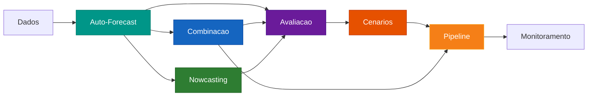

# User Guide

O User Guide cobre em profundidade cada modulo do **forecastbox**. Cada secao explica
a teoria, os parametros, exemplos praticos e melhores praticas para uso em producao.

---

## Modulos

-   :material-auto-fix:{ .lg .middle } **Auto-Forecast**

    ---

    Selecao automatica de modelos e hiperparametros. AutoARIMA, AutoETS,
    AutoVAR e modelos customizados via ModelZoo.

    [:octicons-arrow-right-24: Auto-Forecast](auto-forecast/index.md)

-   :material-set-merge:{ .lg .middle } **Combinacao**

    ---

    Combine previsoes de multiplos modelos com 7 metodos: media simples,
    pesos fixos, OLS, stacking, BMA, time-varying e otima.

    [:octicons-arrow-right-24: Combinacao](combination/index.md)

-   :material-test-tube:{ .lg .middle } **Avaliacao**

    ---

    Testes estatisticos para comparacao de modelos: Diebold-Mariano,
    Model Confidence Set, Giacomini-White, Mincer-Zarnowitz e encompassing.

    [:octicons-arrow-right-24: Avaliacao](evaluation/index.md)

-   :material-chart-timeline-variant:{ .lg .middle } **Cenarios**

    ---

    Previsao condicional, stress testing, simulacao Monte Carlo e fan charts
    para analise de cenarios e planejamento.

    [:octicons-arrow-right-24: Cenarios](scenarios/index.md)

-   :material-clock-fast:{ .lg .middle } **Nowcasting**

    ---

    Previsao em tempo real com Dynamic Factor Models, bridge equations e MIDAS
    para dados de frequencias mistas.

    [:octicons-arrow-right-24: Nowcasting](nowcasting/index.md)

-   :material-pipe:{ .lg .middle } **Pipeline**

    ---

    Pipeline de producao com monitoramento de drift, re-estimacao automatica
    e alertas de degradacao.

    [:octicons-arrow-right-24: Pipeline](pipeline/index.md)

-   :material-flask:{ .lg .middle } **Experiment**

    ---

    Framework para comparar multiplos modelos, combinacoes e horizontes
    em um unico experimento reprodutivel.

    [:octicons-arrow-right-24: Experiment](experiment.md)

---

## Mapa do Workflow

O diagrama abaixo mostra como os modulos se conectam em um fluxo tipico de previsao:

| Etapa | Modulo | Descricao |
|:------|:-------|:----------|
| 1 | **Auto-Forecast** | Estima modelos individuais com selecao automatica |
| 2 | **Avaliacao** | Compara modelos com testes estatisticos rigorosos |
| 3 | **Combinacao** | Combina previsoes dos melhores modelos |
| 4 | **Cenarios** | Gera previsoes condicionais e stress tests |
| 5 | **Nowcasting** | Previsao em tempo real com dados de alta frequencia |
| 6 | **Pipeline** | Automatiza o fluxo completo em producao |

---

## Onde Comecar

!!! tip "Recomendacao"

    Se voce esta comecando agora, siga esta ordem:

    1. **[Auto-Forecast](auto-forecast/index.md)** — aprenda a estimar modelos individuais
    2. **[Avaliacao](evaluation/index.md)** — compare e selecione os melhores modelos
    3. **[Combinacao](combination/index.md)** — combine previsoes para ganhar robustez
    4. **[Pipeline](pipeline/index.md)** — coloque em producao

    Para workflows mais avancados, explore **Cenarios** e **Nowcasting**.
