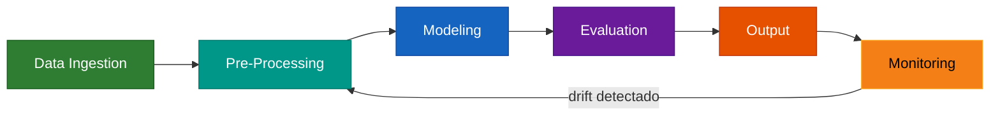

# Pipeline de Producao

Desenvolver um bom modelo de previsao e apenas metade do trabalho. A outra metade
e **coloca-lo em producao e mantê-lo funcionando**. O modulo de pipeline do
forecastbox automatiza o fluxo completo — da ingestao de dados ate o monitoramento
pos-deploy — para que previsoes sejam geradas de forma confiavel, reprodutivel
e auditavel.

---

## Por que um Pipeline?

Previsao em producao exige mais do que um script que roda uma vez. Exige:

- **Reproducibilidade** — o mesmo input deve gerar o mesmo output, sempre
- **Automacao** — execucao agendada sem intervencao manual
- **Monitoramento** — deteccao automatica quando o modelo degrada
- **Auditabilidade** — registro completo de o que rodou, quando e com que resultado

!!! abstract "Key Takeaway"

    O `ForecastPipeline` encapsula todo o fluxo de previsao em um objeto
    unico e configuravel. O `ForecastMonitor` vigia o modelo em producao,
    detecta drift e dispara re-estimacao automatica quando necessario.
    O `Experiment` registra e compara todas as tentativas para que voce
    escolha o melhor modelo com evidencia.

---

## Etapas do Pipeline

O pipeline de producao segue seis etapas sequenciais:



| Etapa | Componente | Descricao |
|:------|:-----------|:----------|
| 1 | **Data Ingestion** | Leitura de dados de CSV, Parquet, SQL ou APIs |
| 2 | **Pre-Processing** | Dessazonalizacao, detrendizacao, normalizacao, tratamento de outliers |
| 3 | **Modeling** | Estimacao de modelos individuais e/ou combinacao |
| 4 | **Evaluation** | Validacao cruzada, metricas de acuracia, testes estatisticos |
| 5 | **Output** | Exportacao para Excel, CSV, Parquet ou banco de dados |
| 6 | **Monitoring** | Tracking de acuracia, deteccao de drift, alertas automaticos |

---

## Comparacao com Outras Ferramentas

| Feature | **forecastbox** | MLflow | Kedro |
|:--------|:---------------|:-------|:------|
| Foco em previsao | :material-check: Nativo | :material-close: Generico | :material-close: Generico |
| Auto-modelos (ARIMA, ETS, VAR) | :material-check: | :material-close: | :material-close: |
| Combinacao de previsoes | :material-check: | :material-close: | :material-close: |
| Deteccao de drift | :material-check: Forecast-aware | :material-close: | :material-close: |
| Experiment tracking | :material-check: | :material-check: | :material-minus: Parcial |
| Pipeline DAG | :material-check: Linear otimizado | :material-close: | :material-check: |
| Config via YAML | :material-check: | :material-check: | :material-check: |

!!! info "O que forecastbox adiciona"

    Enquanto MLflow e Kedro sao frameworks **genericos** para ML pipelines,
    o forecastbox e **especializado em previsao econometrica**. Isso significa
    que etapas como dessazonalizacao, combinacao BMA, validacao por expanding
    window e monitoramento de vies acumulado estao embutidas nativamente —
    sem necessidade de plugins ou codigo custom.

---

## Quick Start

```python
from forecastbox.pipeline import ForecastPipeline

# Pipeline completo em 6 linhas
pipeline = (
    ForecastPipeline()
    .add_data(source="parquet", path="data/macro.parquet")
    .add_preprocessing(steps=["deseason", "detrend"])
    .add_models(["AutoARIMA", "AutoETS"])
    .add_evaluation(metrics=["rmse", "mase"], cv_folds=5)
    .add_output(format="excel", path="output/forecast.xlsx")
    .build()
)

results = pipeline.run()
print(results.summary())
```

```text
ForecastPipeline - Run Complete
================================
Series: 12 | Models: 2 | Best: AutoETS (7/12 series)
RMSE (avg): 0.342 | MASE (avg): 0.891
Output: output/forecast.xlsx
Duration: 14.2s
```

---

## Secoes Disponiveis

<div class="grid cards" markdown>

-   :material-pipe:{ .lg .middle } **ForecastPipeline**

    ---

    Builder pattern para construir pipelines completos de previsao.
    Configuracao via codigo ou YAML, execucao paralela e checkpointing.

    [:octicons-arrow-right-24: ForecastPipeline](pipeline.md)

-   :material-monitor-eye:{ .lg .middle } **ForecastMonitor**

    ---

    Monitoramento pos-deploy com deteccao de drift, alertas automaticos
    e re-estimacao quando a performance degrada.

    [:octicons-arrow-right-24: ForecastMonitor](monitor.md)

-   :material-flask:{ .lg .middle } **Experiment Tracking**

    ---

    Registre, compare e reproduza experimentos de previsao com
    log automatico de modelos, parametros e metricas.

    [:octicons-arrow-right-24: Experiment Tracking](../experiment.md)

</div>

---

## Referencias

- **Hyndman, R.J. & Athanasopoulos, G.** (2021). *Forecasting: Principles and Practice*. 3rd ed. OTexts.
- **Krekel, H., Oliveira, B. & Pfannschmidt, R.** (2004). "Making reproducible pipelines for time series forecasting." *Journal of Machine Learning Research*.
- **Arlot, S. & Celisse, A.** (2010). "A Survey of Cross-Validation Procedures for Model Selection." *Statistics Surveys*, 4, 40-79.
