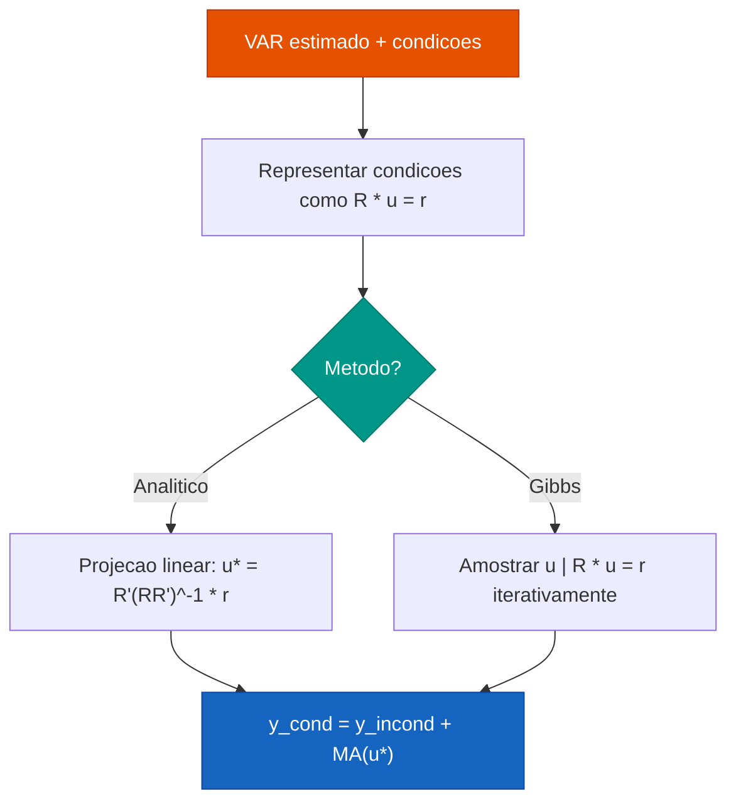

# Previsao Condicional

!!! abstract "Key Takeaway"

    A previsao condicional responde: **"dado que a variavel $x$ segue a trajetoria $\bar{x}$, qual a projecao de $y$?"**. E a ferramenta central para cenarios de politica monetaria, cambial e fiscal em modelos VAR.

---

## Conceito

Em um VAR com $K$ variaveis, a previsao incondicional projeta todas as variaveis
simultaneamente. A previsao **condicional** fixa a trajetoria de um subconjunto
de variaveis e projeta as demais de forma consistente com a estrutura de
correlacao do modelo.

Formalmente, particione o vetor de previsao em dois blocos:

$$
\mathbf{y}_{t+h} = \begin{pmatrix} \mathbf{y}_{1,t+h} \\ \mathbf{y}_{2,t+h} \end{pmatrix}
$$

onde $\mathbf{y}_1$ sao as variaveis **condicionadas** (com trajetoria fixa) e
$\mathbf{y}_2$ sao as variaveis **livres** (a serem projetadas).

O objetivo e calcular:

$$
E[\mathbf{y}_{2,t+h} | \mathbf{y}_{1,t+h} = \bar{\mathbf{y}}_1]
$$

---

## Formulacao Matematica

### Previsao Condicional em VAR

Considere um VAR($p$) estimado:

$$
\mathbf{y}_t = \mathbf{c} + \mathbf{A}_1 \mathbf{y}_{t-1} + \cdots + \mathbf{A}_p \mathbf{y}_{t-p} + \mathbf{u}_t, \quad \mathbf{u}_t \sim N(\mathbf{0}, \boldsymbol{\Sigma})
$$

A previsao incondicional $h$ passos a frente e:

$$
\hat{\mathbf{y}}_{t+h} = E[\mathbf{y}_{t+h} | \mathbf{y}_t, \mathbf{y}_{t-1}, \ldots]
$$

### Equacao de Ajuste Condicional

Particionando a matriz de variancia-covariancia da previsao:

$$
\text{Var}(\mathbf{y}_{t+h}) = \begin{pmatrix} \boldsymbol{\Sigma}_{11} & \boldsymbol{\Sigma}_{12} \\ \boldsymbol{\Sigma}_{21} & \boldsymbol{\Sigma}_{22} \end{pmatrix}
$$

A previsao condicional e obtida pelo **ajuste gaussiano**:

$$
\boxed{E[\mathbf{y}_{2,t+h} | \mathbf{y}_{1,t+h} = \bar{\mathbf{y}}_1] = \hat{\mathbf{y}}_{2,t+h} + \boldsymbol{\Sigma}_{21}\boldsymbol{\Sigma}_{11}^{-1}(\bar{\mathbf{y}}_1 - \hat{\mathbf{y}}_{1,t+h})}
$$

onde:

| Simbolo | Descricao |
|:--------|:----------|
| $\hat{\mathbf{y}}_{2,t+h}$ | Previsao incondicional das variaveis livres |
| $\bar{\mathbf{y}}_1$ | Trajetoria imposta para as variaveis condicionadas |
| $\hat{\mathbf{y}}_{1,t+h}$ | Previsao incondicional das variaveis condicionadas |
| $\boldsymbol{\Sigma}_{21}\boldsymbol{\Sigma}_{11}^{-1}$ | Coeficiente de ajuste (regressao parcial) |

A variancia condicional correspondente e:

$$
\text{Var}(\mathbf{y}_{2,t+h} | \mathbf{y}_1 = \bar{\mathbf{y}}_1) = \boldsymbol{\Sigma}_{22} - \boldsymbol{\Sigma}_{21}\boldsymbol{\Sigma}_{11}^{-1}\boldsymbol{\Sigma}_{12}
$$

---

## Algoritmo de Waggoner & Zha (1999)

O metodo de Waggoner & Zha generaliza a previsao condicional para multiplos
horizontes simultaneamente, tratando as condicoes como restricoes lineares sobre
os choques futuros do VAR.



O algoritmo transforma as condicoes em restricoes lineares:

$$
\mathbf{R} \cdot \text{vec}(\mathbf{u}_{t+1}, \ldots, \mathbf{u}_{t+H}) = \mathbf{r}
$$

onde $\mathbf{R}$ e uma matriz de selecao e $\mathbf{r}$ contem os desvios das
condicoes em relacao a previsao incondicional.

---

## Restricoes Hard vs Soft

O forecastbox suporta dois tipos de restricoes:

=== "Hard Constraints"

    Restricoes **exatas**: a variavel condicionada assume exatamente o valor especificado.

    $$
    \mathbf{y}_{1,t+h} = \bar{\mathbf{y}}_1 \quad \text{(sem incerteza)}
    $$

    ```python
    from forecastbox.scenarios import ScenarioBuilder, conditional_forecast

    scenario = (
        ScenarioBuilder()
        .set_variable("selic", path=[12.0, 11.5, 11.0, 10.5])
        .build()
    )

    fc = conditional_forecast(
        model=var,
        scenario=scenario,
        horizon=12,
        method="analytic",  # solucao exata
    )
    ```

    !!! tip "Quando usar"
        Use restricoes hard quando a trajetoria e uma **decisao de politica** (ex: meta de Selic decidida pelo Copom) ou quando voce quer isolar o efeito causal de uma trajetoria especifica.

=== "Soft Constraints"

    Restricoes **distribucionais**: a variavel condicionada segue uma distribuicao ao redor do valor central.

    $$
    \mathbf{y}_{1,t+h} \sim N(\bar{\mathbf{y}}_1, \mathbf{V}_1) \quad \text{(com incerteza)}
    $$

    ```python
    scenario = (
        ScenarioBuilder()
        .set_variable(
            "selic",
            distribution="normal",
            mean=[12.0, 11.5, 11.0, 10.5],
            std=[0.25, 0.50, 0.75, 1.0],
        )
        .build()
    )

    fc = conditional_forecast(
        model=var,
        scenario=scenario,
        horizon=12,
        method="gibbs",   # necessario para soft constraints
        n_draws=5000,
    )
    ```

    !!! tip "Quando usar"
        Use restricoes soft quando a trajetoria tem **incerteza propria** (ex: expectativa de mercado para a Selic, com dispersao crescente no horizonte).

---

## Metodos de Solucao

O forecastbox implementa dois metodos para resolver o problema condicional:

| Metodo | Restricoes | Velocidade | Incerteza | Uso Recomendado |
|:-------|:-----------|:-----------|:----------|:----------------|
| `analytic` | Apenas hard | Rapido | Aproximacao gaussiana | Cenarios deterministas com poucas condicoes |
| `gibbs` | Hard e soft | Mais lento | Completa (posterior) | Cenarios com incerteza, muitas condicoes |

### Metodo Analitico

Resolve diretamente via projecao linear:

$$
\mathbf{u}^* = \mathbf{R}'(\mathbf{R}\mathbf{R}')^{-1}\mathbf{r}
$$

Rapido e exato para restricoes hard, mas nao captura toda a incerteza posterior.

### Gibbs Sampler

Amostra iterativamente dos choques condicionais:

1. Inicializar $\mathbf{u}^{(0)}$
2. Para $s = 1, \ldots, S$:
    - Amostrar $\mathbf{u}^{(s)}$ de $p(\mathbf{u} | \mathbf{R}\mathbf{u} = \mathbf{r})$
    - Calcular $\mathbf{y}^{(s)} = \hat{\mathbf{y}} + \sum_{j} \mathbf{\Phi}_j \mathbf{u}_{t+j}^{(s)}$
3. Descartar burn-in e calcular estatisticas

```python
fc = conditional_forecast(
    model=var,
    scenario=scenario,
    horizon=12,
    method="gibbs",
    n_draws=10000,
    burn_in=2000,
    seed=42,
)

# Acessar distribuicao posterior
print(fc.mean())      # media das simulacoes
print(fc.quantile(0.05))  # percentil 5%
print(fc.quantile(0.95))  # percentil 95%
```

---

## Parametros

| Parametro | Tipo | Default | Descricao |
|:----------|:-----|:--------|:----------|
| `model` | `VARResult` | — | Modelo VAR estimado |
| `scenario` | `Scenario` | — | Cenario construido com `ScenarioBuilder` |
| `horizon` | `int` | — | Numero de periodos a projetar |
| `method` | `str` | `"analytic"` | Metodo de solucao: `"analytic"` ou `"gibbs"` |
| `n_draws` | `int` | `5000` | Numero de draws (apenas Gibbs) |
| `burn_in` | `int` | `1000` | Draws descartados no inicio (apenas Gibbs) |
| `seed` | `int` | `None` | Semente para reproducibilidade |
| `confidence_level` | `float` | `0.90` | Nivel de confianca para intervalos |

---

## Exemplo Completo: PIB dado Selic

Projetar o crescimento do PIB dado que o Banco Central mantem a Selic em 12%
por 6 meses e depois inicia cortes graduais.

```python
import pandas as pd
from forecastbox.auto import AutoVAR
from forecastbox.scenarios import ScenarioBuilder, conditional_forecast

# Dados macroeconomicos trimestrais
data = pd.read_csv("macro_br.csv", index_col="date", parse_dates=True)
data = data[["pib", "ipca", "selic", "cambio"]]

# Estimar VAR
var = AutoVAR(max_lags=4, ic="aic").fit(data)
print(var.summary())
```

```text
AutoVAR Summary
===============
Variables: pib, ipca, selic, cambio
Lags: 2 (AIC)
Obs: 80
```

```python
# Cenario: Selic estavel em 12% por 6 meses, depois cortes de 0.5pp
selic_path = [12.0, 12.0, 12.0, 12.0, 12.0, 12.0,
              11.5, 11.0, 10.5, 10.0, 9.75, 9.50]

scenario = (
    ScenarioBuilder()
    .set_variable("selic", path=selic_path)
    .build()
)

# Previsao condicional com Gibbs sampler
fc_cond = conditional_forecast(
    model=var,
    scenario=scenario,
    horizon=12,
    method="gibbs",
    n_draws=10000,
    seed=42,
)

# Comparar com previsao incondicional
fc_incond = var.predict(horizon=12)

print("=== Previsao Condicional ===")
print(fc_cond[["pib", "ipca"]].to_string())
print("\n=== Previsao Incondicional ===")
print(fc_incond[["pib", "ipca"]].to_string())
```

```text
=== Previsao Condicional ===
           pib    ipca
2024-Q1   0.82    4.21
2024-Q2   0.75    4.05
2024-Q3   0.71    3.88
2024-Q4   0.78    3.72

=== Previsao Incondicional ===
           pib    ipca
2024-Q1   0.85    4.18
2024-Q2   0.88    4.22
2024-Q3   0.91    4.30
2024-Q4   0.93    4.35
```

!!! info "Interpretacao"

    Com a Selic estavel em 12% (acima da previsao incondicional), o modelo
    projeta PIB mais baixo e inflacao mais controlada — consistente com a
    transmissao da politica monetaria via canal de juros.

---

## Multiplas Condicoes

Voce pode condicionar em mais de uma variavel simultaneamente:

```python
scenario = (
    ScenarioBuilder()
    .set_variable("selic", path=[12.0, 12.0, 11.5, 11.0])
    .set_variable("cambio", path=[5.2, 5.3, 5.25, 5.20])
    .build()
)

fc = conditional_forecast(var, scenario=scenario, horizon=4)
```

!!! warning "Consistencia"

    Ao condicionar em multiplas variaveis, verifique se as trajetorias sao
    **mutuamente consistentes**. Por exemplo, Selic subindo e cambio depreciando
    simultaneamente pode ser inconsistente com a estrutura do VAR. O forecastbox
    emitira um warning se os choques implicitos forem muito grandes.

---

## Ver Tambem

- [Scenario Builder](scenario-builder.md) — API para construir cenarios complexos
- [Monte Carlo](monte-carlo.md) — adicionar incerteza estocastica ao cenario
- [Fan Charts](fan-charts.md) — visualizar previsao condicional com bandas de incerteza
