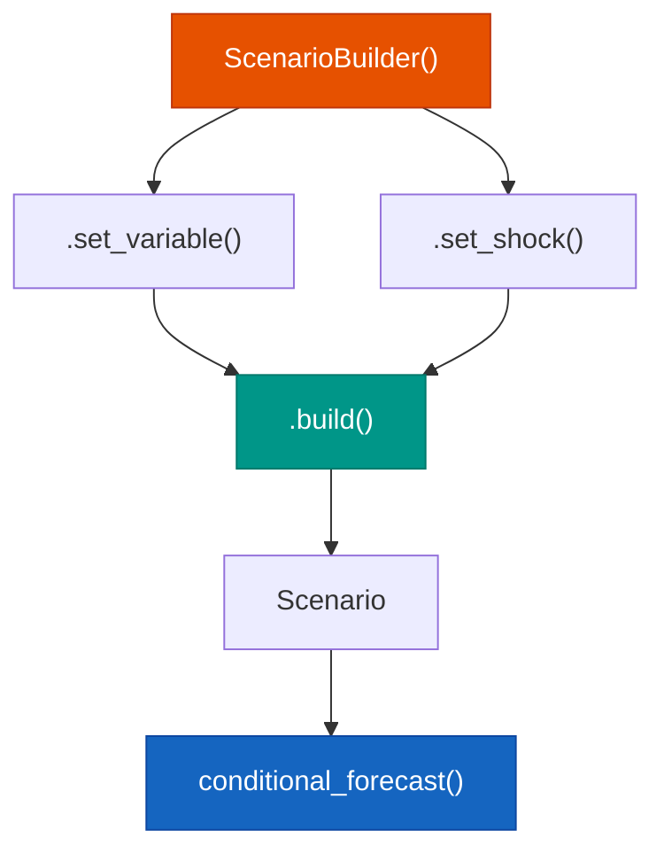

# Scenario Builder

!!! abstract "Key Takeaway"

    O `ScenarioBuilder` usa um **builder pattern fluent** para construir cenarios complexos
    de forma legivel e composivel. Defina trajetorias, distribuicoes e choques para
    variaveis individuais, e combine-os em cenarios nomeados para comparacao.

---

## Conceito

A construcao de cenarios segue uma logica de composicao:

1. **Criar** um builder
2. **Adicionar** restricoes variavel por variavel
3. **Construir** o cenario final

Cada restricao pode ser uma trajetoria fixa (hard constraint), uma distribuicao
(soft constraint) ou um choque pontual/persistente.



---

## API Basica

### Trajetoria Fixa

Define um caminho determinista para a variavel:

```python
from forecastbox.scenarios import ScenarioBuilder

scenario = (
    ScenarioBuilder()
    .set_variable("selic", path=[12.0, 11.5, 11.0, 10.5, 10.0, 9.75])
    .build()
)
```

### Distribuicao

Define uma restricao soft — a variavel segue uma distribuicao ao redor do valor central:

```python
scenario = (
    ScenarioBuilder()
    .set_variable(
        "cambio",
        distribution="normal",
        mean=5.2,
        std=0.3,
    )
    .build()
)
```

### Choque

Aplica um choque pontual ou persistente:

```python
scenario = (
    ScenarioBuilder()
    .set_shock(
        "oil_price",
        type="step",       # choque permanente
        magnitude=20,      # aumento de 20 unidades
        start=3,           # a partir do periodo 3
    )
    .build()
)
```

---

## Tipos de Restricoes

| Metodo | Tipo | Parametros | Descricao |
|:-------|:-----|:-----------|:----------|
| `set_variable(path=)` | Hard | `path: list[float]` | Trajetoria exata periodo a periodo |
| `set_variable(distribution=)` | Soft | `distribution, mean, std` | Distribuicao ao redor do valor central |
| `set_variable(value=)` | Hard | `value: float` | Valor constante em todos os periodos |
| `set_shock(type="impulse")` | Hard | `magnitude, start` | Choque em um unico periodo |
| `set_shock(type="step")` | Hard | `magnitude, start` | Choque permanente a partir de `start` |
| `set_shock(type="ramp")` | Hard | `magnitude, start, end` | Choque gradual entre `start` e `end` |

---

## Composicao de Cenarios

### Multiplas Variaveis

Encadeie chamadas para condicionar em multiplas variaveis:

```python
scenario = (
    ScenarioBuilder()
    .set_variable("selic", path=[12.0, 11.5, 11.0, 10.5])
    .set_variable("cambio", distribution="normal", mean=5.2, std=0.3)
    .set_shock("oil_price", type="step", magnitude=20, start=3)
    .build()
)
```

### Cenarios Nomeados

Use nomes para organizar e comparar cenarios:

```python
baseline = (
    ScenarioBuilder(name="Baseline")
    .set_variable("selic", path=[12.0, 11.5, 11.0, 10.5])
    .set_variable("cambio", value=5.0)
    .build()
)

otimista = (
    ScenarioBuilder(name="Otimista")
    .set_variable("selic", path=[11.0, 10.5, 10.0, 9.5])
    .set_variable("cambio", value=4.8)
    .build()
)

pessimista = (
    ScenarioBuilder(name="Pessimista")
    .set_variable("selic", path=[13.5, 14.0, 14.5, 14.5])
    .set_variable("cambio", value=5.8)
    .set_shock("oil_price", type="step", magnitude=30, start=1)
    .build()
)
```

---

## Cenarios Pre-Definidos

O forecastbox inclui templates para cenarios comuns:

=== "Baseline"

    Cenario base com projecoes de mercado (Focus/BCB):

    ```python
    from forecastbox.scenarios import ScenarioBuilder

    baseline = (
        ScenarioBuilder(name="Baseline")
        .set_variable("selic", path=[12.0, 11.75, 11.50, 11.25, 11.0, 10.75])
        .set_variable("cambio", value=5.05)
        .set_variable("ipca_meta", value=3.0)
        .build()
    )
    ```

=== "Otimista"

    Cenario com afrouxamento monetario acelerado e apreciacao cambial:

    ```python
    otimista = (
        ScenarioBuilder(name="Otimista")
        .set_variable("selic", path=[11.5, 11.0, 10.5, 10.0, 9.5, 9.0])
        .set_variable("cambio", path=[5.0, 4.95, 4.90, 4.85, 4.80, 4.75])
        .build()
    )
    ```

=== "Pessimista"

    Cenario com aperto monetario e depreciacao cambial:

    ```python
    pessimista = (
        ScenarioBuilder(name="Pessimista")
        .set_variable("selic", path=[12.5, 13.0, 13.5, 14.0, 14.0, 14.0])
        .set_variable("cambio", path=[5.3, 5.5, 5.7, 5.8, 5.9, 6.0])
        .set_shock("oil_price", type="step", magnitude=25, start=1)
        .build()
    )
    ```

---

## Comparacao de Cenarios

Use `compare_scenarios` para avaliar multiplos cenarios simultaneamente:

```python
from forecastbox.scenarios import conditional_forecast, compare_scenarios

# Gerar previsoes para cada cenario
results = {}
for scenario in [baseline, otimista, pessimista]:
    results[scenario.name] = conditional_forecast(
        model=var,
        scenario=scenario,
        horizon=12,
    )

# Comparar
comparison = compare_scenarios(results, variables=["pib", "ipca"])
print(comparison)
```

```text
Scenario Comparison (horizon=12)

Variable: pib
                 Baseline   Otimista   Pessimista
2024-Q1            0.82       0.89        0.71
2024-Q2            0.79       0.95        0.58
2024-Q3            0.81       1.02        0.45
2024-Q4            0.85       1.08        0.38

Variable: ipca
                 Baseline   Otimista   Pessimista
2024-Q1            4.21       4.15        4.35
2024-Q2            4.05       3.82        4.68
2024-Q3            3.88       3.55        5.12
2024-Q4            3.72       3.30        5.45
```

---

## Exportar e Importar Cenarios

Cenarios podem ser serializados para compartilhamento e reproducibilidade:

=== "JSON"

    ```python
    # Exportar
    scenario.to_json("cenario_baseline.json")

    # Importar
    from forecastbox.scenarios import Scenario
    loaded = Scenario.from_json("cenario_baseline.json")
    ```

    ```json
    {
      "name": "Baseline",
      "variables": {
        "selic": {
          "type": "path",
          "values": [12.0, 11.75, 11.50, 11.25, 11.0, 10.75]
        },
        "cambio": {
          "type": "constant",
          "value": 5.05
        }
      },
      "shocks": {}
    }
    ```

=== "YAML"

    ```python
    # Exportar
    scenario.to_yaml("cenario_baseline.yaml")

    # Importar
    loaded = Scenario.from_yaml("cenario_baseline.yaml")
    ```

    ```yaml
    name: Baseline
    variables:
      selic:
        type: path
        values: [12.0, 11.75, 11.50, 11.25, 11.0, 10.75]
      cambio:
        type: constant
        value: 5.05
    shocks: {}
    ```

---

## Validacao

O `ScenarioBuilder` valida automaticamente na chamada `.build()`:

!!! warning "Validacoes Automaticas"

    - **Variaveis existem no modelo**: erro se a variavel nao faz parte do VAR
    - **Comprimento do path**: warning se `len(path) < horizon`; valores faltantes sao preenchidos com o ultimo valor
    - **Consistencia**: warning se os choques implicitos excedem 3 desvios-padrao dos residuos do modelo
    - **Distribuicoes**: erro se parametros invalidos (ex: `std < 0`)

```python
# Isso gera um erro — variavel nao existe no modelo
scenario = (
    ScenarioBuilder()
    .set_variable("variavel_inexistente", path=[1, 2, 3])
    .build()
)
# ScenarioError: Variable 'variavel_inexistente' not found in model
```

---

## Parametros do ScenarioBuilder

| Parametro | Tipo | Default | Descricao |
|:----------|:-----|:--------|:----------|
| `name` | `str` | `None` | Nome do cenario (para comparacao) |

### `set_variable()`

| Parametro | Tipo | Default | Descricao |
|:----------|:-----|:--------|:----------|
| `name` | `str` | — | Nome da variavel no modelo |
| `path` | `list[float]` | `None` | Trajetoria periodo a periodo |
| `value` | `float` | `None` | Valor constante |
| `distribution` | `str` | `None` | Distribuicao: `"normal"`, `"t"`, `"uniform"` |
| `mean` | `float \| list` | `None` | Media (ou lista por periodo) |
| `std` | `float \| list` | `None` | Desvio-padrao (ou lista por periodo) |

### `set_shock()`

| Parametro | Tipo | Default | Descricao |
|:----------|:-----|:--------|:----------|
| `name` | `str` | — | Nome da variavel a ser chocada |
| `type` | `str` | — | Tipo: `"impulse"`, `"step"`, `"ramp"` |
| `magnitude` | `float` | — | Tamanho do choque (em unidades da variavel) |
| `start` | `int` | `1` | Periodo inicial do choque |
| `end` | `int` | `None` | Periodo final (apenas `"ramp"`) |

---

## Ver Tambem

- [Previsao Condicional](conditional.md) — como o cenario e usado na previsao
- [Monte Carlo](monte-carlo.md) — adicionar incerteza estocastica
- [Stress Testing](stress-testing.md) — cenarios de estresse com choques extremos
